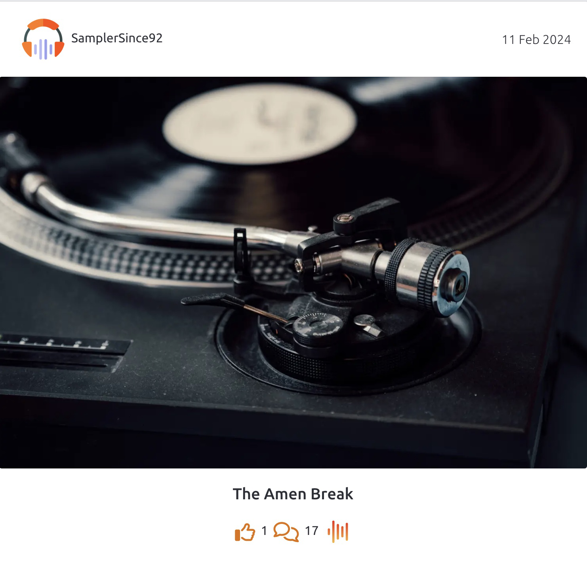

# **Rewind**

<br>


<br>

[View the deployed site on Heroku](https://rkdev-rewind-ed88f8459fe7.herokuapp.com/)

<br>

Rewind has been developed as part of the [Code Institute](https://codeinstitute.net/) Diploma in Full Stack Software Development (Advanced Front End Portfolio Project #5).  The Django REST Framework has been used to build a backend API.  This returns JSON data to the front end which has been built using React.  The aim of the site is to provide a platform for a community of like minded music/technology enthusiasts who enjoy sharing snippets of nostalgia to evoke memories of the past and engaging in conversations about these snapshots in time.

## **CONTENTS**

* [User Experience (UX)](#user-experience-ux)
    * [Strategy Plane](#strategy-plane)
        * [Project Goals](#project-goals)
    * [Agile Methodology](#agile-methodology)
        * [Epics](#epics)
        * [User Stories](#user-stories)
    * [Scope Plane](#scope-plane)
    * [Skeleton Plane](#skeleton-plane)
        * [Wireframes](#wireframes)
        * [Database Schema](#database-schema)
    * [Structure Plane](#structure-plane)
        * [Features](#features)
    * [Surface Plane](#surface-plane)
* [Technologies Used](#technologies-used)
    * [Languages Used](#languages-used)
    * [Programs and Tools Used](#programs-and-tools-used)
    * [Frameworks and Libraries Used](#frameworks-and-libraries-used)
* [Testing](#testing)
* [Deployment and Local Development](#deployment-and-local-development)
* [Bugs](#bugs)
    * [Known Bugs](#known-bugs)
    * [Solved Bugs](#solved-bugs)
* [Credits](#credits)
    * [Code Used and Referenced](#code-used-and-referenced)
    * [Media](#media)
    * [Acknowledgements](#acknowledgements)

# **User Experience (UX)**

## **STRATEGY PLANE**

## **Project Goals**

The aim of the site is to create a community for music/technology enthusiasts with a particular emphasis on the ability to share memories and reminisce.  The term 'nostalgia' can be defined as "a feeling of sadness mixed with pleasure and affection when you think of happy times in the past".  This is a powerful emotion to tap into and cyclical patterns can be seen in fashion, music and technology.  The resurgence in the Vinyl market is a great demonstration of this.  Although the primary target site user may be those wishing to share their memories, this does not limit the target audience to those who witnessed trends and movements the first time round.  It will also engage a new generation where there is great interest for all things 'Retro' and an enthusiasm to discover more about these bygone eras.

Rewind will give users a platform to post their own 'snapshots' from the past and enter into discussion about fellow user's memories.  To ensure that site users can intuitively and effortlessly access content most relevant to their interets, they will be given the opportunity to tailor their user profiles to indicate their preferences.  This data will be used to recommend other profiles and snapshots that may be of interest to the user.  Users will also have the ability to recommend snapshots that they have enjoyed and this data will be stored in the database, so it can then be used as mechanism for users to sort content.  To fit in with busy lives of a site user, they will also have the ability to pin snapshots while they scroll, so they can easily return to them at a later date.

Although the initial build of the site focuses on music/technology, site traffic could be increased by expanding genres / categories to appeal to a more diverse range of users.  For example additional categories such as Fashion, Art, Design could be added as instances in the Category Model

<br>

[Back to top &uarr;](#contents)

## **AGILE METHODOLOGY**

This project was approached following the principles of Agile Development, building the solution incrementally through repeated iterations.  Initially, 6 [epics](#Epics) were defined.  These were broad definitions of functionality for the site that would not fit into a single iteration.

Epics were then broken down into user stories and logged as issues on GitHub using the following [customised template](https://github.com/rkillickdev/rewind/blob/main/.github/ISSUE_TEMPLATE/user-story.md).  Acceptance Criteria were defined as part of each user story to clearly present the objectives and conditions that must be satisfied for the user story to be marked as complete.  Implementation of the user story was then broken down into tasks - technical work required to facilitate execution of the user story.  Each user story was given a story points label to indicate the estimated amount of work required to complete the story.

A 7th [DRF API Epic](https://github.com/rkillickdev/rewind/issues/30) was defined to plan work required to build the backend API using the Django REST Framework.  This epic was broken down into the key backend resources required to implement the functionality of the site.  Relevant user stories were linked and tasks allocated to complete the build of each resource. 

A [Product Backlog](https://github.com/rkillickdev/rewind/milestone/1) milestone was created on GitHub to establish a 'single authoritative source of work'.  I initially moved all user stories to the backlog before they were allocated to sprints.  The product backlog was refined throughout the course of development with user stories reprioritised as the project evolved.

Timeboxing was used throughout the development of the project.  Week long 'sprints' (otherwise referred to as iterations) were defined using Milestones on Github.  User stories from the product backlog were then allocated to a sprint following the principles of MoSCoW prioritisation.  Each user story was assigned a label specifying "Must Have", "Could Have" or "Should Have" to indicate expectation of its completion.  Stories were then tackled according to level of priority.  When defining prioritisation levels for each user story in a sprint, I was mindful that the percentage of "Must Haves" should 'not exceed 60% of the overall effort planned for the iteration'.  A 20% contingency of "Could Haves" was set, therefore leaving the remaining 20% for "Should Haves".  If it was clear that a user story would not be completed in the current sprint, it was labelled as "Won't Have" and returned to the Product Backlog.  This was then allocated to a future sprint with a higher prioritisation level.

Throughout the development process, I used a kanban board to provide up to date information about the status of progress for each iteration.  The board was created and managed using GitHub Projects and can be viewed [here](https://github.com/users/rkillickdev/projects/5).

User stories for each sprint were initially allocated to the 'Todo' column and then transferred to the 'In Progress' column as they were worked on.  Once each task for the user story had been completed and all acceptance criteria satisfied, the issue was marked as complete and moved to the 'Done' column.

[Back to top &uarr;](#contents)

### **Epics**

#### **EPIC: Navigation & User Authentication [#1](https://github.com/rkillickdev/rewind/issues/1)**

`
Users should be able to navigate the site effortlessly and access the site content in an intuitive manner. Certain features should only be accessible to authenticated users that have created a user profile.
`

#### **EPIC: Snapshot Lists [#8](https://github.com/rkillickdev/rewind/issues/8)**

`
Snapshots posted to the site should be available for all user to view, with authenticated users given additional control over the type of content they want to view.
`

#### **EPIC: Create Snapshots [#12](https://github.com/rkillickdev/rewind/issues/12)**

`
Logged in users should have the ability to post snapshots that will then be attached to their profile and available for other site users to enjoy.
`

#### **EPIC: Snapshot Details [#15](https://github.com/rkillickdev/rewind/issues/15)**

`
The detail page should display a specified snapshot post. All site users should have the ability to 'read' snapshots, logged in users should have the ability to comment on other user's snapshots and update/delete their own.
`

#### **EPIC: Recommend and Pin Snapshots [#21](https://github.com/rkillickdev/rewind/issues/21)**

`
As the user is viewing content on the site, they should have the ability to recommend snapshots and also pin any snapshot that catches their interest that they might want to return to later.
`

#### **EPIC: Profiles [#24](https://github.com/rkillickdev/rewind/issues/24)**

`
Logged in users should have the ability to update and tailor their own profile details. They should also be able to view the profiles of other site users and their associated snapshot posts. Users should be recommended other profiles to follow based on musical genre preferences specified in their own profiles
`

[Back to top &uarr;](#contents)

### **User Stories**

#### **EPIC: Navigation & User Authentication [#1](https://github.com/rkillickdev/rewind/issues/1)**

* As a user I can access a navbar on every page so that navigation of the site is intuitive [#2](https://github.com/rkillickdev/rewind/issues/2)
* As a user I can navigate the content of the site without the page refreshing so that content is accessed quickly and user experience is enhanced [#3](https://github.com/rkillickdev/rewind/issues/3)
* As a user I can sign up and create a user account so that I can access additional site functionality only available to authenticated users [#4](https://github.com/rkillickdev/rewind/issues/4)
* As a user I can sign in using my existing credentials so that I can view my account and continue enjoying site functionality only accessible to authenticated users [#5](https://github.com/rkillickdev/rewind/issues/5)
* As a user I can see whether I am already logged in so that I am aware of my status and the features of the site I can access [#6](https://github.com/rkillickdev/rewind/issues/6)
* As a user I can sign out from the site so that no one else using my device can access my account [#7](https://github.com/rkillickdev/rewind/issues/7)

#### **EPIC: Snapshot Lists [#8](https://github.com/rkillickdev/rewind/issues/8)**

* As a user I can view all snapshots posted so that I can get an overview of the type of content available on the site and decide whether I would like to sign up [#9](https://github.com/rkillickdev/rewind/issues/9)
* As a user I can search snapshots by keywords so that I can filter results displayed by their text content or by the profile of the poster [#10](https://github.com/rkillickdev/rewind/issues/10)
* As a user I can choose to order the list by 'most liked' or 'most talked about' so that I can view most popular snapshots first [#11](https://github.com/rkillickdev/rewind/issues/11)
* As a user I can filter the list of snapshots on the home page by era, genre and category so that I can view snapshots most relevant to my interests [#39](https://github.com/rkillickdev/rewind/issues/39)

#### **EPIC: Create Snapshots [#12](https://github.com/rkillickdev/rewind/issues/12)**

* As a logged in user I can post image snapshots so that I can share my nostalgic memories with other site users [#13](https://github.com/rkillickdev/rewind/issues/13) 
* As a logged in user I can upload audio clips when creating a snaphot so that I can share audio memories with other site users [#14](https://github.com/rkillickdev/rewind/issues/14)

#### **EPIC: Snapshot Details [#15](https://github.com/rkillickdev/rewind/issues/15)**

* As a user I can view a snapshot detail page so that I can read the full description of the snapshot and any associated comments [#16](https://github.com/rkillickdev/rewind/issues/16)
* As a logged in user I can edit my own snapshots so that I can update and amend the details of my original post [#17](https://github.com/rkillickdev/rewind/issues/17)
* As a logged in user I can comment on another user's snapshot so that I can share my thoughts and interact with the Rewind community [#18](https://github.com/rkillickdev/rewind/issues/18)
* As a logged in user I can edit my own comments so that I can amend and update my thoughts [#19](https://github.com/rkillickdev/rewind/issues/19)
* As a logged in user I can delete my own comments so that I can control whether a previous comment remains visible to other site users [#20](https://github.com/rkillickdev/rewind/issues/20)

#### **EPIC: Recommend and Pin Snapshots [#21](https://github.com/rkillickdev/rewind/issues/21)**

* As a logged in user I can recommend a snapshot so that I can show my appreciation of another user's post and encourage others to view it [#22](https://github.com/rkillickdev/rewind/issues/22)
* As a logged in user I can pin any snapshots of interest while browsing the site so that I can build a list of posts to return to later [#23](https://github.com/rkillickdev/rewind/issues/23)

#### **EPIC: Profiles [#24](https://github.com/rkillickdev/rewind/issues/24)**

* As a logged in user I can edit the details of my profile so that I can update my profile pic, bio details and preferences for era, musical genre and category [#25](https://github.com/rkillickdev/rewind/issues/25)
* As a user I can view the profile pages of other site users so that I can learn more about them and the type of content they are posting [#26](https://github.com/rkillickdev/rewind/issues/26)
* As a logged in user I can update my username and password so that I can choose how my name is displayed to other users and to ensure my login credentials remain secure [#27](https://github.com/rkillickdev/rewind/issues/27)
* As a logged in user I can view suggested profiles so that I can decide whether their previous snapshot posts are of interest to me [#28](https://github.com/rkillickdev/rewind/issues/28)
* As a logged in user I can choose to follow profiles that are posting interesting content so that I can be updated with more of their posts in the future [#29](https://github.com/rkillickdev/rewind/issues/29)

[Back to top &uarr;](#contents)

## **SCOPE PLANE**

In order to satisfy the goals and user stories outlined in the [strategy plane](#strategy-plane), I will implement the following features:

* Implement functionality for all users to read snapshots posted by other site users.
* Implement functionality for all users to read comments relating to user's snapshot posts.
* Implement functionality for all users to view the profiles of other site users.
* Implement functionality for users to create a user account and access additional site features.
* Implement functionality for logged in users to create and update their own snapshot posts.
* Implement functionality for logged in users to create, update and delete their own comments about a particular snapshot post. 
* Implement functionality for logged in users to like snapshots posted by other site users
* Implement functionality for logged in users to pin snapshots posted by other site users so they can easily return to it
* Implement functionality for displaying suggested profiles to logged  in users, based on their own musical preferences
* Implement functionality to allow logged in users to follow profiles they want to hear more from

[Back to top &uarr;](#contents)

## **SKELETON PLANE**

## **Database Schema**


The following custom models have been implemented as part of the development process:

### **PROFILE**

An instances of the Profile model is created automatically when a user signs up for an account and is connected to the User model via a one to one field.  Users are able to edit the `name`, `bio` and `image` fields.

There is a many to many relationship connecting the Profile model to the Era, Genre and Category models.  This gives the user the ability to set their preferences for the type of snapshot posts they are most interested in viewing.  The many to many link means that a user could attach several different eras/ genres/ categories to their profile, and a single instance of an Era/ Genre/ Category can belong to many different profiles.

### **Profile API Endpoints**
___

| HTTP REQUEST | URI | CRUD Operation | View Type |
| ------------ | --- | -------------- | --------- |
| GET | /profiles | List all profiles | LIST |
| GET | /profiles/:id | Retrieve a profile by id | DETAIL |
| PUT | /profiles/:id | Update a profile by id | DETAIL |

### **ERA / GENRE/ CATEGORY**

Multiple instances of Era / Genre/ Category can belong to multiple profiles.  This data will then be used to tailor content presented to site users and make suggestions for other profiles to follow.  

The Era / Genre / Category models are linked to the Snapshot model via a foreign key field.  For example, a single instance of Era,Genre or Category can belong to many different instances of Snapshot.

The API endpoints detailed below have been built to allow for eventual implementation of 'Create', 'Read' and 'Update' functionality on these models from the front end.  Although not included in the initial scope of the project, building this functionality into the backend will allow for a future feature whereby a site administrator can add additional eras/ generes/ categories via the site interface rather than using the Django admin panel.  This functionality could be implemented in future sprints.

The `IsAdminUser` class from the rest_framwork permissions has been included in the views for eras, genres and categories to ensure only staff users can access the following API endpoints.

### **Era API Endpoints**
___

| HTTP REQUEST | URI | CRUD Operation | View Type |
| ------------ | --- | -------------- | --------- |
| GET | /eras | List all eras | LIST |
| POST | /eras | Create an era | LIST |
| GET | /eras/:id | Retrieve an era by id | DETAIL |
| PUT | /eras/:id | Update an era by id | DETAIL |

### **Genre API Endpoints**
___

| HTTP REQUEST | URI | CRUD Operation | View Type |
| ------------ | --- | -------------- | --------- |
| GET | /genres | List all genres | LIST |
| POST | /genres | Create a genre | LIST |
| GET | /genres/:id | Retrieve a genre by id | DETAIL |
| PUT | /genres/:id | Update a genre by id | DETAIL |

### **Category API Endpoints**
___

| HTTP REQUEST | URI | CRUD Operation | View Type |
| ------------ | --- | -------------- | --------- |
| GET | /categories | List all categories | LIST |
| POST | /categories | Create a category | LIST |
| GET | /categories/:id | Retrieve a category by id | DETAIL |
| PUT | /categories/:id | Update a category by id | DETAIL |

### **SNAPSHOT**

As noted above, there is a 'One To Many' relationship linking the Era, Genre and Category models to the Snapshot model.  The User model is also linked to the Snapshot model via a 'One To Many' relationship, whereby a single instance of User can own many instances of Snapshot.  When a new instance of Snapshot is created (only avaialable to authenticated users), the owner field of the Snapshot model is automatically populated with the logged in user.  The perform_create method defined in the [snapshots/views](snapshots/views.py) takes care of this task.  Authenticated users are able to perform full CRUD functionality on the Snaphot model, although the ability to Update or Delete an instance is only available if the user owns the specified instance.

### **Snapshot API Endpoints**
___

| HTTP REQUEST | URI | CRUD Operation | View Type |
| ------------ | --- | -------------- | --------- |
| GET | /snapshots | List all snapshots | LIST |
| POST | /snapshots | Create a snapshot | LIST |
| GET | /snapshots/:id | Retrieve a snapshot by id | DETAIL |
| PUT | /snapshots/:id | Update a snapshot by id | DETAIL |
| DELETE | /snapshots/:id | Delete a snapshot by id | DETAIL |

### **RECOMMENDATION**

The Snapshot model is linked to the Recommendation model via a 'One To Many relationship' - Many instances of Recommendation can belong to a single instance of Snapshot.  As was the case with the Snapshot model above, the User model is also linked to the Recommendation model via a 'One To Many' relationship.  The relationship is automatically established each time a new instance of Recommendation is created. Authenticated users are able Create and Retrieve instances of Recommendation and delete them if the user owns the instance.  There is no need to provide the ability to update an istance of Recommendation, and this is reflected in the specified API Endpoints below.

### **Recommendation API Endpoints**
___

| HTTP REQUEST | URI | CRUD Operation | View Type |
| ------------ | --- | -------------- | --------- |
| GET | /recommendations | List all recommendations | LIST |
| POST | /recommendations | Create a recommendation | LIST |
| GET | /recommendations/:id | Retrieve a recommendation by id | DETAIL |
| DELETE | /recommendations/:id | Delete a recommendation by id | DETAIL |

### **COMMENT**

There are 'One To Many' relationships between User / Snapshot models and Comment Model.  Many comments could be associated with either a single User or Snapshot.  All users can retrieve comments, authenticated users can create an instance and update/delete an instance if they are the owner. 

### **Comment API Endpoints**
___

| HTTP REQUEST | URI | CRUD Operation | View Type |
| ------------ | --- | -------------- | --------- |
| GET | /comments | List all comments | LIST |
| POST | /comments | Create a comment | LIST |
| GET | /comments/:id | Retrieve a comment by id | DETAIL |
| PUT | /comments/:id | Update a comment by id | DETAIL |
| DELETE | /comments/:id | Delete a comment by id | DETAIL |

### **FOLLOWER**

There are two relationships between the User model and the Follower model.  Both are 'One To Many' relationships.  It is important to include 'related_names' in this case to distinguish between the two.  A user could be connected to an instance of Follower because they are the owner (i.e. following another user), or because they are being 'followed'.  Either way, many instances of Follower can be associated with a User.  They might be following many others, or being followed by many others.  Authenticated users can 'follow' another user (i.e. create an instance).  There is no need to include an API endpoint for updating an instance of Follower.  Deleting an instance is the equivalent of 'unfollowing' another user and can only be carried out by an authenticated user who owns the instance.

### **Follower API Endpoints**
___

| HTTP REQUEST | URI | CRUD Operation | View Type |
| ------------ | --- | -------------- | --------- |
| GET | /followers | List all followers | LIST |
| POST | /followers | Create a follower | LIST |
| GET | /followers/:id | Retrieve a follower by id | DETAIL |
| DELETE | /followers/:id | Delete a follower by id | DETAIL |

### **PIN**

Relationship between User and Snapshot models via 'One To Many' relationship.  Authenticated users can create a new pin.  If the authenticated user also owns the pin they can delete it. 

### **Pin API Endpoints**
___

| HTTP REQUEST | URI | CRUD Operation | View Type |
| ------------ | --- | -------------- | --------- |
| GET | /pins | List all pins | LIST |
| POST | /pins | Create a pin | LIST |
| GET | /pins/:id | Retrieve a pin by id | DETAIL |
| DELETE | /pins/:id | Delete a pin by id | DETAIL |

<br>

### **Security**
___

#### **Defensive Programming**
___

To secure certain Django Views and ensure they are only accessible to registered users, permission classes have been set in the views.py file of each Django App.  Two classes have been used:

* `IsAuthenticatedOrReadOnly` is a Django REST Framework built in permission class.  It allows users to perform any request.  Requests for unauthenticated users are only permitted if the request method is one of the "safe" methods; `GET`, `HEAD` or `OPTIONS`.  This ensures that only logged in users are granted write permissions.

* `IsOwnerOrReadOnly` is a custom class stored in rewind/permissions.py which extends DRF permissions.BasePermission. The method `has_object_permissions' defined within the class, returns a boolean value.  If the request method received is one of the "safe" methods, true is returned as all users are permitted to make these requests.  If not a safe method, true is only returned if the current user is the owner of an object.  This ensures that users can only update or delete an object that they own.  This is an important security consideration .  Although functionality to update and delete objects owned by another user is not provided in the user interface, this alone does not provide adequate protection.  Objects in the database could still be targeted using specific urls.  The inclusion of permission_classes add this additional layer of defence.

* `ReadOnly` is a custom class stored in rewind/permissions.py which extends DRF permissions.BasePermission.  If the request method received is one of the "safe" methods, true is returned.  I added this custom permission to the ListCreateAPIView for eras, genres and categories to ensure that all users have read permissions but only admin users have permission to create new instances.

```python
permission_classes = [permissions.IsAdminUser|ReadOnly]
```

* Unit tests have been written to check the functionality of these permission classes.  Documentation for this can be found in the [TESTING.md](https://github.com/rkillickdev/rewind/blob/main/TESTING.md) file.

#### **Protection Of Sensitive Details**
___

Any keys containing sensitive data were stored in and retrieved from the env.py file during development. This was added to the gitignore file to ensure this data was never pushed to the GitHub repo.  For the deployed production version of the site hosted on Heroku, these sensitive keys are stored securely in the config vars.

In the settings file, for I have declared ```DEBUG = 'DEBUG' in os.environ```.  This means that DEBUG will only equate to True in development mode.  In production, the 'DEBUG' variable is not stored and therefore equates to False.  It is important for DEBUG not to be enabled in production, as this prevents users from seeing the detailed traceback displayed by Django if an exception is raised.  Although this is useful while in development mode, these messages could contain information about the site that we would not want the final user to see.

<br>

## **Wireframes**

Wireframes were created using [Balsamiq](https://balsamiq.com/wireframes/) and used as a blueprint for development of the site layout and structure.

<details><summary>Mobile</summary>

<br>


</details>

[Back to top &uarr;](#contents)

## **STRUCTURE PLANE**

## **Features**

<details>
<summary> Navbar
</summary>

<br>


| | User Story | Acceptance Criteria Satisfied | 
| --- | ------------ | :---: | 
| [#2](https://github.com/rkillickdev/rewind/issues/2) | As a user I can access a navbar on every page so that navigation of the site is intuitive | Pass |
___

The NavBar component is displayed at the top of all pages.  In order to achieve this, it has been included as the first component in the return statement of `App.js`

To the left of the navbar is the brand logo that is designed to instantly communicate the core aims of the site.  The use of a cassette tape aims to immediately make the user subconsciously aware that 'retro technology and music' is at the heart of the site's objectives.  The colours used in the brand logo are consistent with the colour scheme used throughout the rest of the site, which are designed to be retro in their feel.  The hover effect applied to the brand logo is consistent with the effect used for other clickable links throughout.  Clicking on the logo takes the site user back to the home page.

To the right of the navbar, page links are displayed and a hover effect applied so users know they are clickable.  Links for the currently active page are styled using the site's dark colour.  Dependent on the status of the site user, links display as shown in the table below.  This helps to signal to the user their current authentication status.

| Link | Visibility |
| ---- | -------- |
| Home |  All users |
| For You | Logged in users |
| Pinned |  Logged in users |
| Profile | Logged in users |
| Sign up |  Logged out users |
| Sign in | Logged out users |
| Sign out | Logged in users |

<br>


The Profile link is coupled with an avatar.  If the user has edited their profile and added their own personal image, this is displayed.  A default image is displayed in cases where the user has not yet added an image.

| | User Story | Acceptance Criteria Satisfied | 
| --- | ------------ | :---: | 
| [#6](https://github.com/rkillickdev/rewind/issues/6) | As a user I can see whether I am already logged in so that I am aware of my status and the features of the site I can access | Pass |
___

To ensure good user experience and satisfy the site owner's goal of responsive design across a range of device sizes, the navigation menu collapses down into a hamburger menu on screen sizes below 992px.  This prevents the navbar from feeling cluttered on smaller devices and the instantly recognisable hamburger icon ensures that site navigation remains intuitive for users.


Clicking on the hamburger icon expands the nav links which are stacked vertically to the left of the screen.  Clicking on a link, the icon or anywhere else on the pag collapses the nav menu.


The React Router library is used to handle routing for the application, with specified urls routing the user to different pages.  However this happens without the browser refreshing as the router handles these changes in the React virtual DOM.  In reality each time a user navigates to a new 'page', it is always the same HTML page but with a different component rendered.

| | User Story | Acceptance Criteria Satisfied | 
| --- | ------------ | :---: | 
| [#3](https://github.com/rkillickdev/rewind/issues/3) | As a user I can navigate the content of the site without the page refreshing so that content is accessed quickly and user experience is enhanced | Pass |
___

<br>

</details>

<details>
<summary> Sign Up Form
</summary>

<br>


Clicking on the 'Sign up' nav link renders the `SignUpForm` component where a new user can create an account.  This also provides a link to the 'Sign in' page, in case the user already has an account.

| | User Story | Acceptance Criteria Satisfied | 
| --- | ------------ | :---: | 
| [#4](https://github.com/rkillickdev/rewind/issues/4) | As a user I can sign up and create a user account so that I can access additional site functionality only available to authenticated users  | Pass |
___

</details>

<details>
<summary> Sign In Form
</summary>

<br>


Clicking on the 'Sign in' nav link renders the `SignInForm` component where a user with existing credentials can sign in.  This also provides a link to the 'Sign up' page, in case the user does not yet have an account.

| | User Story | Acceptance Criteria Satisfied | 
| --- | ------------ | :---: | 
| [#5](https://github.com/rkillickdev/rewind/issues/5) | As a user I can sign in using my existing credentials so that I can view my account and continue enjoying site functionality only accessible to authenticated users | Pass |
___

<br>

</details>

<details>
<summary> Snapshots Page
</summary>

* The SnapshotsPage component is rendered using the React Router whenever the user naviagates to the exact url for 'Home', 'For You' or 'Pinned'.  

* A search bar positioned at the top of the page allows the user to search for snapshots based on their title, era, musical genre or category.  The filtering happens dynamically as the user types via the backend using the DRF SearchFilter as specified in `snapshots/views.py`.  Below the search bar, a list of snapshots is displayed.


| | User Story | Acceptance Criteria Satisfied | 
| --- | ------------ | :---: |
| [#10](https://github.com/rkillickdev/rewind/issues/10) | As a user I can search snapshots by keywords so that I can filter results displayed by their text content or by the profile of the poster | Pass |

* Icons allowing user to sort snapshots by recommendation count, comment count or most recently updated are displayed when the SnapshotsPage component is rendered with the `home` prop passed to it.  Clicking on each of the icons re-orders the list of snapshots accordingly.


| | User Story | Acceptance Criteria Satisfied | 
| --- | ------------ | :---: |
| [#11](https://github.com/rkillickdev/rewind/issues/11) | As a user I can choose to order the list by 'most liked' or 'most talked about' so that I can view most popular snapshots first | Pass |

* The `Snapshot` component is rendered for each snapshot in the list, each with a unique key (this is provided by the snapshot id).  This displays the Profile avatar and name of the owner, Snapshot image, title, date created and description if available.  Exactly what else the user sees is determined by their authentication status and props passed into the component.


### **All Users**

* All users navigating to the 'Home' page can view a list of all snapshots, ordered by the most recently created.

| | User Story | Acceptance Criteria Satisfied | 
| --- | ------------ | :---: | 
| [#9](https://github.com/rkillickdev/rewind/issues/9) | As a user I can view all snapshots posted so that I can get an overview of the type of content available on the site and decide whether I would like to sign up | Pass |

### **Unauthenticated**



* Icons and tallies for recommendation and comment counts are displayed.  If the user tries to recommend the snapshot, a tooltip provides feedback that they must be signed in to carry out this action.  Clicking on the comments icon directs the user to the Snapshot Detail Page.


* To the right of the Snapshot list, a reuseable `UserDirection` component is rendered to display a hero image and 'call to action' button, encouraging the user to 'get started' by signing up.

### **Authenticated**

* The AddSnapshot component is rendered.  This displays a clickable icon which directs the user to the `SnapshotCreateForm`


* Users can recommend/ remove recommendations for snaphots that they do not own.  If they own the snapshot and attempt to recommend, a tooltip provides feedback that they cannot carry out this action.


| | User Story | Acceptance Criteria Satisfied | 
| --- | ------------ | :---: | 
| [#22](https://github.com/rkillickdev/rewind/issues/22) | As a logged in user I can recommend a snapshot so that I can show my appreciation of another user's post and encourage others to view it  | Pass |

* Users can pin/ remove pins for any snapshot.


| | User Story | Acceptance Criteria Satisfied | 
| --- | ------------ | :---: | 
| [#23](https://github.com/rkillickdev/rewind/issues/23) | As a logged in user I can pin any snapshots of interest while browsing the site so that I can build a list of posts to return to later   | Pass |

* If a user has not set their profile preferences, a `UserDirection` component is rendered with props passed to display a reminder message and button directing them to their profile edit page.


* The RelevantProfiles component is rendered to the right of the snapshot list (see description of the component below).

* Authenticated users navigating to the 'For you' page can view a list of snapshots filtered by any snapshot belonging to a profile they are following.  This stage of the filtering is carried out on the backend, with the required filterset field passed to the component as a prop.  Returned results are ordered according to recommendation count (descending order).


If a user has not followed any other profiles, a resuable `Asset` component is rendered to display a message encouraging the user to start following other profiles to fill the page.


* If a user has specified their preferences on the profile edit page, Snapshots on the 'For You' page will be further filtered on the frontend to match these preferences.  This ensures that each user receives bespoke content best matched to their interests.  If the frontend filtering returns no results, by default snapshots belonging to all followed profiles are displayed.


* Authenticated users navigating to the 'Pinned' page can view a list of all snapshots that they have pinned, ordered by most recently created (descending order).


* Pins can be removed for a snapshot on the 'Pinned' page and the list dynamically updates in response to this, so the targeted snapshot is no longer displayed.


</details>

<details>
<summary> SnapshotCreateForm
</summary>

* The `SnapshotCreateForm` component is rendered by the react router when a user navigates to the `/snapshots/create` url.

* To successfully create a new snaphot, the user must select an image and input a title.  Description is optional.  The snapshot must also be given an era, genre and category.

* On successful submission, a toast alert is used to notify users that the snapshot has been created.


| | User Story | Acceptance Criteria Satisfied | 
| --- | ------------ | :---: |
| [#13](https://github.com/rkillickdev/rewind/issues/13) | As a logged in user I can post image snapshots so that I can share my nostalgic memories with other site users | Pass |


</details>

<details>
<summary> Snapshot Page
</summary>

<br>

* The SnapshotPage component is rendered using the React Router whenever the user naviagates to the exact url `/snapshots/:id`.  This displays details for a snapshot specified by the id supplied in the url.  As detailed in the description for the `SnapshotsPage` component, the `Snapshot` component is rendered to display this information.


| | User Story | Acceptance Criteria Satisfied | 
| --- | ------------ | :---: |
| As a user I can view a snapshot detail page so that I can read the full description of the snapshot and any associated comments | [#16](https://github.com/rkillickdev/rewind/issues/16) | Passed |

 Additionally, the following components are rendered:

### **Unauthenticated**

* A list of approved samples relating to the associated snapshot is displayed above the `Snapshot` component, with the `Sample` component used to render each sample.  Each has it's own unique key (this is provided by the sample id).  A rendered Sample component displays the Profile avatar and name of the sample owner.  A media player to audition the audio sample is displayed.  To ensure good user experience, the user must instigate playback of the sample themselves.

* If no samples are associated with the snapshot, a message is displayed to the user to convey this information.

* A list of comments relating to the associated snapshot is displayed below the `Snapshot` component, with the `Comment` component used to render each comment.  Each has it's own unique key (this is provided by the comment id).  A rendered Comment component displays the Profile avatar and name of the comment owner, the comment and the date created.

* If no comments are associated with the snapshot, a message is displayed to the user to convey this information.

### **Authenticated**


* The `SampleCreateForm` component is rendered above the `sample` and `Snapshot` components.  This provides users with the ability to select an audio file and upload.  On successful upload, a toast alert is used to notify users that the new sample has been created.


| | User Story | Acceptance Criteria Satisfied | 
| --- | ------------ | :---: |
| [#14](https://github.com/rkillickdev/rewind/issues/14) | As a logged in user I can upload audio clips when creating a snaphot so that I can share audio memories with other site users | Pass |


* The `CommentCreateForm` component is rendered directly below the `Snapshot` component and above the `Comment` component.  This provides a text area input field where users can write a comment.  While this field is empty, the 'post' button is disabled.  Only when text has been entered can the comment be posted.  On successful creation of a comment, a toast alert is used to notify users that the new comment has been created.


| | User Story | Acceptance Criteria Satisfied | 
| --- | ------------ | :---: |
| [#18](https://github.com/rkillickdev/rewind/issues/18) | As a logged in user I can comment on another user's snapshot so that I can share my thoughts and interact with the Rewind community | Passed |

### **Authenticated & Owner of Snapshot**


* The `EditDelete` component is rendered within the `Snapshot` component.  This displays clickable icons for editing or deleting the snapshot.

* Clicking on the edit icon directs the user to the url path `/snapshots/:id/edit`.  This route renders the SnapshotEditForm component.  Here a user can update details of their Snapshot.  On successful submission, a toast alert is used to notify users that the snapshot has been updated.


* Clicking on the delete icon triggers rendering of the `ModalPopup` component.  This allows the user to confirm that they definitely want to delete the snapshot.  Upon successful deletion, a toast alert is used to notify users that the snapshot has been deleted.


| | User Story | Acceptance Criteria Satisfied | 
| --- | ------------ | :---: |
| [#17](https://github.com/rkillickdev/rewind/issues/17) | As a logged in user I can edit my own snapshots so that I can update and amend the details of my original post | Passed | 


### **Authenticated & Owner of Comment**


* The `EditDelete` component is rendered within the `Comment` component.  This displays clickable icons for editing or deleting the snapshot.

* Clicking on the edit icon renders the `CommentEditForm` component in place of the `Comment` component.  Here a user can update the content of their comment.  On successful submission, a toast alert is used to notify users that the comment has been updated.


| | User Story | Acceptance Criteria Satisfied | 
| --- | ------------ | :---: |
| [#19](https://github.com/rkillickdev/rewind/issues/19) | As a logged in user I can edit my own comments so that I can amend and update my thoughts | Passed |

* Clicking on the delete icon triggers rendering of the `ModalPopup` component.  This allows the user to confirm that they definitely want to delete the comment.  Upon successful deletion, a toast alert is used to notify users that the comment has been deleted.


| | User Story | Acceptance Criteria Satisfied | 
| --- | ------------ | :---: |
| [#20](https://github.com/rkillickdev/rewind/issues/20) | As a logged in user I can delete my own comments so that I can control whether a previous comment remains visible to other site users | Passed |

### **Authenticated & Owner of Sample**


* The `EditDelete` component is rendered within the `Sample` component.  As the user only has the ability to delete samples, only the `handleDelete` prop is passed to EditDelete.  This displays a  clickable icons for deleting the sample.

* Clicking on the delete icon triggers rendering of the `ModalPopup` component.  This allows the user to confirm that they definitely want to delete the sample.  Upon successful deletion, a toast alert is used to notify users that the sample has been deleted.


</details>

<details>
<summary> Relevant Profiles
</summary>

<br>

* The `RelevantProfilePage` component is rendered as part of the `SnapshotsPage` component, if the user is authenticated.

* If the user has not yet specified any preferences on their profile edit page, the rendered `RelevantProfilePage` component displays a list of popular profiles in descending order, based on the number of followers each profile has.  In this scenario, every user will be presented with the same list.  Howver, code has been implemented to ensure that the logged in user's own profile does not appear in the list they are presented with.


* If the user has selected their preferences on the Profile Edit page, these are retrieved via the `CurrentUserContext`.  This information is then used to carry out frontend filtering of the 'popular profiles' list to return a list of suggested profiles whose interests/ preferences are most closely aligned with the current user.  It's possible that no results are returned, especially while the datatabase of profiles grows.  In this case, the list of popular profiles are displayed as a default.


| | User Story | Acceptance Criteria Satisfied | 
| --- | ------------ | :---: |
| [#28](https://github.com/rkillickdev/rewind/issues/28) | As a logged in user I can view suggested profiles so that I can decide whether their previous snapshot posts are of interest to me | Pass |

* For each profile in the returned list, the `Profile` component is rendered.  It accepts the profile data as a prop, destructures this and uses it to display the Avatar and name for the associated profile.  If the logged in user is not following a profile, a 'follow' button is displayed.  Once they are following a profile, an 'unfollow' button is displayed.

| | User Story | Acceptance Criteria Satisfied | 
| --- | ------------ | :---: |
| [#29](https://github.com/rkillickdev/rewind/issues/29) | As a logged in user I can choose to follow profiles that are posting interesting content so that I can be updated with more of their posts in the future | Pass |

</details>

<details>
<summary> Profile Page
</summary>

### **Unauthenticated**

* The `ProfilePage` component is rendered using the React Router whenever the user naviagates to the exact url `/profiles/:id`.  This displays the following details for a profile specified by the id supplied in the url:

 1. Image
 2. Profile Name
 3. The number of snapshots the profile has added
 4. The number of followers the profile has
 5. The number of other profiles that the specified profile is following

* For every snapshot associated with the profile, a `Snapshot` component is rendered beneath the profile details.


| | User Story | Acceptance Criteria Satisfied | 
| --- | ------------ | :---: |
| [#26](https://github.com/rkillickdev/rewind/issues/26) | As a user I can view the profile pages of other site users so that I can learn more about them and the type of content they are posting | Pass |

### **Authenticated**

* The profile id of the selected profile page is compared with the profile id of the current user.  If the logged in user is not the owner of the profile, a follow/ unfollow button is displayed.


### **Authenticated & Profile Owner**

* The `ProfileEditOptions` component is rendered below the profile details and 3 icons displayed:

  1. Edit profile directs the user to the following url `/profiles/:id/edit`.  The react router renders the `ProfileEditForm` component
  2. Edit username directs the user to the following url `/profiles/:id/edit/username`.  The react router renders the `UsernameForm` component.
  3. Change password directs the user to the following url `/profiles/:id/edit/password`.  The react router renders the `UserPasswordForm` component.


</details>

<details>
<summary> Profile Edit Form
</summary>

<br>


| | User Story | Acceptance Criteria Satisfied | 
| --- | ------------ | :---: |
| [#25](https://github.com/rkillickdev/rewind/issues/25) | As a logged in user I can edit the details of my profile so that I can update my profile pic, bio details and preferences for era, musical genre and category | Pass |

</details>

<details>
<summary> Username Form
</summary>

<br>


| | User Story | Acceptance Criteria Satisfied | 
| --- | ------------ | :---: |
| [#27](https://github.com/rkillickdev/rewind/issues/27) | As a logged in user I can update my username and password so that I can choose how my name is displayed to other users and to ensure my login credentials remain secure | Pass |

</details>

<details>
<summary> User Password Form
</summary>

<br>


</details>

<details>
<summary> Sign Out
</summary>

<br>


</details>

<details>
<summary> Footer
</summary>

<br>

A simple Footer component is rendered on each page.  The GitHub profile name of the site developer is displayed and a clickable GitHub icon that directs the user to the repository for the Rewind App in a new browser tab.


</details>

<details>
<summary> 404 Error Page
</summary>

<br>

I have included a custom 404 error page as a form of defensive design. This improves the user experience by keeping the user informed about the problem and engaged with the site. The styling imagery and branding used on these pages is consistent with the rest of the user experience. To ensure the user does not decide to navigate away from the site, a 'Go Home' button is displayed. This also ensures they do not have to use the back button in their browser for navigation.

The custom error page has been implemented in `App.js`.  If a url entered by the user matches none of the Route paths specified, the NotFound component is rendered.


</details>

<details>
<summary> Modals
</summary>

<br>

Modals are used to confirm delete actions throughout the app.


</details>

<details>
<summary> Toasts
</summary>

<br>

Bootstrap Toasts are used throughout the app to notify users when their actions have been successful.


</details>

<details>
<summary> Alerts
</summary>

<br>

Alerts are used throughout the app to warn the user of form field arrors and errors associated with requests to the DRF API.


</details>

<details>
<summary> Error Boundaries
</summary>

<br>

Alongside the Alerts I implemented to notify the user of API errors, I also used error boundaries in React as a form of error handling.  I used [this article](https://blog.logrocket.com/react-error-handling-with-react-error-boundary/#error-boundaries-react) to understand and successfully integrate with the project.  I made use of the react-error-boundary library, wrapping the `ErrorBoundary` component round the whole App in `index.js` to catch any errors.  `FallbackComponent` is rendered whenever the ErrorBoundary catches an error, to display a message to the user and provide a button to reset the error state and try rendering the component again.  When this button is clicked, it calls resetErrorBoundary, which triggers the onReset function and clears the error state.  I have specified that the onReset function should direct the user back to the home page.

This is a good example of where installation and implementation of a library has helped to provide an enhanced user experience.  It aims to prevent a situation where the app crashes and the user is faced with a blank screen and no feedback.


</details>

<details>
<summary> Favicon and Meta Tags
</summary>

<br>

A favicon link has been included in the head of the index.html file and displays in each browser tab. The image is the same icon that is used in the navbar brand heading, to ensure consistency of styling.  It is a 16px X 16px ico file generated on the [Favicon.ico & App Icon Generator](https://www.favicon-generator.org/)


Open Graph and Twitter meta tags have been placed in the head of the base.html template to control how the URL is displayed when shared on social media.  It appears as displayed below:


[Back to top &uarr;](#contents)

</details>

<details>
<summary> Responsive Design
</summary>

<br>

I adopted a mobile first approach when designing and building the site. Bootstrap's grid system and responsiveness tiers were used to provide different layouts according to default breakpoints and ensure responsiveness across a range of device sizes. Additional styling tweaks were made using media queries in component css files.

<br>


</details>

<details>
<summary> Accessibility
</summary>

<br>

To ensure that the site is as accessible as possible for all users and compatible with screen readers, I have implemented the following:

* Semantic markup used to structure the HTML code.
* Checked that the colour contrast ratio across the website meets acceptable standards.
* Descriptive alt attributes have been given to all images.
* Aria labels have been used for interactive elements where no accessible name is provided.

I used the [Wave Chrome Extension](https://wave.webaim.org/extension/) to check the accessibility of each page,  Results for this can be viewed in the [TESTING.md file](https://github.com/rkillickdev/rewind/blob/main/TESTING.md)

</details>

<details>
<summary> CRUD functionality
</summary>

<br>

The Rewind app features full CRUD functionality on the Front-End UI, implemented through the code written in React. This allows users to work with records from the Django REST Framework API.

`CREATE` - Users can sign up which creates a new user account and associated profile.  Once authenticated, users can create snapshots, comments and samples.

`READ` - All users can read their own and other user's snapshots, comments and profile.  They can read their own samples and those of other user's that have been approved by an administrator.

`UPDATE` - Authenticated users can update their own profile, snapshots and comments.  They do not have required permissions to update an object belonging to another user.

`DELETE` - Authenticated users can delete their own snapshots, comments and samples.  They do not have required permissions to delete an object belonging to another user.

I have also ensured that regular site users only have **read only** access to the era, genre and category models.  This is so instances of these models can be displayed in form select fields, but I do not want users to have the ability to create, update or delete these files.  


</details>

## **Re-use of components**

Custom re-useable components were created with the intention of reducing code duplication throughout the app.

### `AddSnapshot.js`

Used to include the icon for adding a snapshot on any page where this functionality is required.

### `AlertPopup`

Designed to warn and inform users when errors occur.  This calls the useAlert custom hook, destructures the type and text of the alert and uses this information to display feedback to the user.  I have made use of this component when catching errors related to API requests, so the user is always notified if a problem occurs.

### `Asset.js`

This is a multi purpose component that renders content based on the props passed to it.  It can be used to display an image, message or Bootstrap spinner while waiting for data to load.

### `Avatar`

Used to display the profile images and names of users throughout the app.  It accepts the src and name props as a way of passing the required profile data for each occurence of the Avatar component.  It also accepts a height prop, set as a default to 45px but this can be over written if a larger version of the Avatar is required.  The height passed is also used to determine the width of the image.

### `EditDelete.js`

A flexible re-useable way of rendering edit and delte icons to the page wherever required.  It accepts handleEdit and handleEdit as props which are used to set the onClick functionality of each icon.  Dependent on the props passed to the component, both or just a single icon can be displayed.  For example when using the EditDelete component next to samples, only the delete icon is required as there is no included fuctionality to update a sample.

### `Error.js`

Used to render the ErrorFallback page when an error is detected by an error boundary.  It accepts error and resetErrorBoundary as props.  The error prop could be used to display the exact error to the user, although for now I have chosen to use a more generic, less technical message.

### `Footer.js`

Used to render a simple footer to all pages.

### `ModalPopup`

Used throughout the app as an additional layer of protection when deleting snapshots, comments and samples.  It accepts `title`, `message` and `buttonLabel` props so each modal can be rendered according to it's required purpose.  The `show` and `handleClose` props handle changes to the state of the modal.  It also accepts the `onChange` prop, as a way of passing a function that is then assigned to the onClick attribute of the confirm button.

### `NavBar.js`

This component is rendered at the top of every page as a way of displaying navigation links based on the user's authentication status.

### `NotFound.js`

Displays a message  and home redirection button if a user attempts to navigate to a url path that does not exist.

### `ToastPopup.js`

Similar in function to the `AlertPopup` but this component is used to handle displaying user feedback for CRUD functionality throughout the app.  For example, successful creation, update or deletion of comments.  When the useAlert hook is called and type/ text destructured, if the `type` is 'success', a Bootstrap Toast is rendered displaying the `text` as a message.

### `UserDirection.js`

A flexible component used to render images, messages and buttons based on props passed to it.  For example, it is used to display the home page call to action box for non-authenticated users or the 'set preferences' box for newly authenticated users.

## **Custom hooks**

### `useAlert.js`

Calling this hook makes use of the functionality provided by AlertContext.

### `useClickOutsideToggle.js`

Used to ensure that clicks outide of an expanded menu still result in it closing.  This is called in the NavBar component.

### `useRedirect`

Used as a way of redirecting a user to the homepage based on their log in status.

## **Custom contexts**

### `AlertContext.js`

Created to provide users with a range of feedback messages throughout the app, dependent on the alert `type`.

### `CurrentUserContext.js`

Used to determine the current user's logged in state.

### `OptionsContext.js`

Provides available eras, genres and categories to include when rendering form select options.  This is used when creating/ editing snapshots and profiles.

### `ProfileDataContext.js`

Provides profileData to child components throughout the app.  It also provides access to setProfileData, handleFollow and handleUnfollow.  For example, one user following another profile will update the profileData state which will then be reflected to all other users accessing profileData.


## **Accessibility**

* Redundant Alternative Text occurs for each snapshot as it is the same as the title.


## **Future Features**

| | User Story | Acceptance Criteria Satisfied | 
| --- | ------------ | :---: |
| [#39](https://github.com/rkillickdev/rewind/issues/39) | As a user I can filter the list of snapshots on the home page by era, genre and category so that I can view snapshots most relevant to my interests  | Future Feature |
___

[Back to top &uarr;](#contents)

## **SURFACE PLANE**

## **Colour Palette**

Initial inspiration for the colours used throughout the app came from a classic piece of retro hardware, the Roland TR808 drum machine.


<br>

I used this imagery to build a colour palette with the palette generator tool on the [coolors](https://coolors.co/) website.  I found that I needed to tweak some colours to ensure contrast ratios meet acceptable standards.


<br>

## **Typography**

Spacing and typography is consistent throughout the site to provide the user with a sense of familiarity as they navigate between pages. Font awesome icons are used alongside informational headings to hint at content. The following font have been selected from Google Fonts and imported in the head of the index.html file.

* Ubuntu - main App text
* Amatic SC - feature text
* Bungee Spice - Navbar logo

The Bungee Spice font matches well with the colour themes and retro imagery of the site.


<br>

## **Imagery**

Static images used throughout the site have been chosen to tie in with the retro theme of the app.


<br>

The brand logo used in the navbar has been chosen to envoke feelings of nostalgia and links well to the App name 'Rewind' - a nod to an age where 'rewinding casette tapes was part of daily life. The colour scheme used is consistent with the rest of the site.


<br>

# **Technologies Used**

## **Languages Used**

* [HTML5](https://developer.mozilla.org/en-US/docs/Glossary/HTML5)
* [CSS3](https://developer.mozilla.org/en-US/docs/Web/CSS)
* [Javascript](https://developer.mozilla.org/en-US/docs/Web/JavaScript)
* [Python](https://www.python.org/)

## **Programs and Tools Used**

* [Git](https://en.wikipedia.org/wiki/Git) -  Version control.
* [GitHub](https://github.com/) - All files for the project stored and saved in a repository.
* [Gitpod](https://www.gitpod.io/) - IDE used to write the code, make git commits and push to GitHub.
* [Heroku](https://dashboard.heroku.com/apps) - For deployment of the project.
* [ElephantSQL](https://www.elephantsql.com/) - a PostgreSQL database used for the deployed production site.
* [Cloudinary](https://www.cloudimage.io/) - Used to store user uploaded images and audio files.
* [W3C](https://validator.w3.org/) - HTML Validator
* [W3C jigsaw](https://jigsaw.w3.org/css-validator/) - CSS Validator
* [PEP8](https://pep8ci.herokuapp.com/) - CI Python Linter.
* [ESLint](https://eslint.org/)
* [Prettier](https://prettier.io/)
* [Black](https://www.freecodecamp.org/news/auto-format-your-python-code-with-black/) - Python Auto Formatter.
* [Google Lighthouse](https://developer.chrome.com/docs/lighthouse/overview/) - Used at testing stage to show statistics for performance, accessibility, best practices and SEO.
* [Google DevTools](https://developer.chrome.com/docs/devtools/) - Used throughout build of website for debugging, checking responsiveness and trialing new features/ styling.
* [Google Fonts](https://fonts.google.com/) - Used to import required fonts for the app.
* [Font Awesome](https://fontawesome.com/) - Used for all icons throughout the website.
* [TinyPNG](https://tinypng.com/) - For compression of image files to improve website performance.
* [Birme](https://www.birme.net/?target_width=425&target_height=450&auto_focal=false&image_format=jpeg&quality_jpeg=100&quality_webp=100) - For resizing and re-formatting images to make them suitable for use on the website.
* [xnipapp](https://www.xnipapp.com/) - For capturing site screenshots
* [jpg2png](https://jpg2png.com/) - For conversion of JPG images to PNG format.
* [gyazo](https://gyazo.com/captures) - For mp4 screen captures of site functionality
* [ezgif](https://ezgif.com/video-to-gif) - For conversion of mp4 video files to GIFs
* [dbdiagram](https://dbdiagram.io/home) - Database Relationship Diagrams Design Tool.
* [Balsamiq](https://balsamiq.com/wireframes/) - Used to create wireframes.
* [ImageOnline](https://imageonline.co/merge-png.php) - Used for merging png files
* [Favicon.ico & App Icon Generator](https://www.favicon-generator.org/) - For creating the 16x16px ico favicon.
* [Techsini](https://techsini.com/multi-mockup/index.php) - For displaying images of how the website looks across a range of devices.
* [Meta Tags IO](https://metatags.io/) - For improving site visual appearance on social media.
* [Stackoverflow](https://stackoverflow.com/) - Used for researching solutions/ fixing bugs.


## **Backend  Frameworks and Libraries Used**

* [Django 3.2.23](https://www.djangoproject.com/) - High level Python web framework used in conjunction with DRF for development of the project backend.
* [Django REST Framework](https://www.django-rest-framework.org/) - Framework used to develop the backend API.
* [cloudinary](https://cloudinary.com/) - Python library to facilitate integration of cloudinary with Django
* [dj-databse-url](https://pypi.org/project/dj-database-url/) - A utility that allows use of the DATABASE_URL environment variable to configure a Django application.  This was used for connection to the PostgreSQL database.
* [dj3-cloudinary-storage](https://pypi.org/project/dj3-cloudinary-storage/) - A Django package that facilitates Cloudinary storage for media files used in the project.
* [django-filter](https://django-filter.readthedocs.io/en/stable/#) - Enables filtering of a queryset based on a Model's fields.
* [pillow](https://pypi.org/project/pillow/) - A Python Imaging Library that adds image processing capabilities to your Python interpreter.
* [django-allauth](https://docs.allauth.org/en/latest/) - An integrated set of Django applications addressing authentication, registration and account management.  Used to implement role based login functionality across the site.
* [djangorestframework-simplejwt](https://django-rest-framework-simplejwt.readthedocs.io/en/latest/) - Provides a JSON Web Token authentication backend for the Django REST Framework.
* [dj-rest-auth](https://dj-rest-auth.readthedocs.io/en/latest/) - Provides a set of REST API endpoints to handle User Registration and Authentication tasks.
* [psycopg2](https://pypi.org/project/psycopg2/) - A Python PostgreSQL Database Adapter.
* [gunicorn](https://gunicorn.org/) - A Python WSGI HTTP Server for UNIX.
* [whitenoise](https://pypi.org/project/whitenoise/) - Simplified static file serving for WSGI applications.  I used this to serve static files for both the DRF backend and the React frontend.

## **Frontend Libraries Used**

* [React](https://react.dev/) - A JavaScript library for building user interfaces
* [react-bootstrap 1.6.3](https://react-bootstrap-v4.netlify.app/) - Frontend framework that is compatible with React.  Used to create a responsive site
* [react-router-dom](https://www.npmjs.com/package/react-router-dom) - a library that enables 'client side routing'.  Components used from this library include:
  1. **Switch:** Component used to render the first route that matches the location rather than rendering all matching routes.
  2. **Route:** Component that checks current URL and displays the component associated with that exact path.  All routes are placed within the switch components. 
  3. **Link:** Component used to create links to different routes
* [axios](https://axios-http.com/docs/intro) - A promise-based HTTP library.  THis enabled HTTP requests to be made to the DRF API.
* [react-infinite-scroll-component](https://www.npmjs.com/package/react-infinite-scroll-component) - A component used to implement infinite scrolling for snapshots and comments
* [jwt-decode](https://www.npmjs.com/package/jwt-decode) - Browser library that helps with decoding of Base64URL encoded JSON web tokens.
* [react-error-boundary](https://github.com/bvaughn/react-error-boundary) - A library that provides a way to handle JavaScript errors in React components.

[Back to top &uarr;](#contents)

# **Deployment and Local Development**

I made sure to keep my requirements.txt file up to date throughout, running the command `pip3 freeze --local > requirements.txt` from the terminal whenever any new libraries were installed.  It is important that all requirements are added to this before deployment so Heroku installs the necessary dependencies.

In development mode, the sqlite3 database provided by Django was used but this was not suitable for use in a production environment.  The deployed site uses a PostreSQL database hosted by [elephantSQL](https://www.elephantsql.com/) that Heroku can access.  It was therefore necessary to create an account with elephantSQL, and create a new database instance selecting the Tiny Turtle(free) plan.  My database instance is also named 'rewind'.  From the ElephantSQL dashboard, clicking on the database reveals a 'details' page where you can access the database URL, which is necessary for use in both the production and development environments.

To implement functionality of the PostgreSQL database with Django, the following libraries were installed using the terminal command:

```
pip3 install dj_database_url==0.5.0 psycopg2
```

The database URL contains information that should not be exposed publicly and therefore must not be pushed to the GitHub repository.  For development purposes I stored the database URL in the env.py file which had been added to the gitignore file.  I did not connect to the production Postgres database from my development environment until I was sure that the models were functioning and included all the fields I required.  I used the following code in my settings.py file to enable switching between development and production databases.

```python
if 'DEV_DB' in os.environ:
    DATABASES = {
        'default': {
            'ENGINE': 'django.db.backends.sqlite3',
            'NAME': BASE_DIR / 'db.sqlite3',
        }
    }
else:
    DATABASES = {
        'default': dj_database_url.parse(os.environ.get("DATABASE_URL"))
    }
```

Once happy with the functionality of my models, I temporarily commented out the 'DEV_DB' environment variable so that the IDE could connect with the external database and migrated changes using the following command in the terminal:

```
python3 manage.py migrate
```

Any time I made an amendment to a model, once I had thoroughly tested in development mode I then switched and migrated these changes to the production database.  The 'DEV_DB' variable does not exist in the Heroku config vars and therefore the Deployed version of the site connects to the PostgreSQL production database.  I used this naming convention for the environment variable as I also have a 'DEV' variable but this is used to control the rest framework's default renderer. When not in development mode, the classes attribute is set to JSONRenderer so the frontend React app is sent pure JSON:

```python
if 'DEV' not in os.environ:
    REST_FRAMEWORK['DEFAULT_RENDERER_CLASSES'] = [
        'rest_framework.renderers.JSONRenderer',
    ]
```

A Procfile file is required that provides the commands to Heroku to build and run the project.  This should be created in the project root directory and contain the following commands:

```
  release: python manage.py makemigrations && python manage.py migrate
  web: gunicorn drf_api.wsgi
```

## Setting up a unified project

The app has been developed following a unified approach,  with the DRF API project and React project existing together in one repository and deployed as a single project.  I built the DRF API first and then created and configured a new React project within the existing Django REST Framework workspace.  I followed the steps suggested by Code Institute to achieve this:

1. Open the DRF project workspace and create a new folder in the root directory with the terminal command: ```mkdir frontend```

2. Change directory into the newly created frontend folder, using the terminal command: ```cd frontend```

3. Create a new React app and install all necessary dependencies by running the terminal command: ```npx create-react-app . --template git+https://github.com/Code-Institute-Org/cra-template-moments.git --use-npm```

4. Confirm creation of the app when prompted by entering `y` and then clicking `enter`

5. Wait for all dependencies to be installed. This installation will take some time, the terminal may appear to freeze for a few minutes.

6. Remove the .git folder, .gitignore file and README.md from the frontend folder as these already exist within the root directory of the DRF project.  This can be achieved by entering the following terminal command: ```rm -rf .git .gitignore README.md```
**Be sure to run this command from the frontend directory**

## Preparation for a unified workspace

One of the benefits of operating with a unified project is that it is possible to work on development versions of the DRF API and React projects simultaneously.  The following Code Institute recommended steps were taken to prepare a combined workspace:

1. Add `os.environ['DEBUG'] = '1'` to the env.py file.  In settings.py we have `DEBUG = 'DEBUG' in os.environ`.  Therefore DEBUG equates to True in development and False in production.  We need to do this as we were previously relying on the 'DEV' variable exsting in the env.py file to determine the DEBUG status.  However, this is commented out to allow pure json responses from the API. It's useful to continue viewing the Django logs during development to assist in debugging.

2.  Add a new `ALLOWED_HOST` key to env.py with the value of your development environment URL, wrapped in quotes.
**Ensure you remove the https:// from the beginning, and the trailing slash / from the end of the development environment URL.**

* In settings.py, the following code is set:
```python
 ALLOWED_HOSTS = [
    os.environ.get('ALLOWED_HOST'),
    'localhost',
    ]
```

3. Add a new `CLIENT_ORIGIN` key to env.py with the value of your development environment URL, wrapped in quotes.
**This string should include the https:// at the beginning, but the trailing slash / should be removed.**

4. Keys for `DATABASE_URL` and `CLOUDINARY_URL` should also have values set if they have not been already.

5. In settings.py use the following code:

```python
CORS_ALLOWED_ORIGINS = [
    os.environ.get('CLIENT_ORIGIN')
]
```

6. Open the package.json file in the frontend directory, and at the bottom of the file, add a new key to the JSON object:

* `"proxy": "http://localhost:8000/"`

7. Create the `axiosDefaults.js` file (When it comes to deployment, the BaseURL setting will need to be defined but for now this file is left empty):

* `cd frontend/src`
* `mkdir api`
* `cd api`
* `touch axiosDefaults.js`

## Running the unified development environment

1. Open two terminals, side by side
2. Check that Terminal 1 is in the root directory and run the Django API with the terminal command: 
* `python3 manage.py runserver`
3. Check that Terminal 2 is in the frontend directory.  If necessary use `cd frontend` to change directory from the root.  Run the React app with the terminal command:
* `npm start`

Both the DRF API and React App should now be running in the same worksapce.  The Django API will run on Port 8000, and the React application will run on Port 8080, or Port 3000 depending on which IDE you are using.


## Preparation for deployment of the unified project (DRF API)

I followed the following steps recommended by Code Institute:

1. Install whitenoise to enable storage of static files using the terminal command:
* `pip3 install whitenoise==6.4.0`
2. Add this dependency to the requirements.txt file using the terminal command:
* `pip3 freeze > requirements.txt`
3. Create a new empty folder called staticfiles in the root directory with the terminal command:
* `mkdir staticfiles`
4. In the INSTALLED_APPS list, ensure that the cloudinary_storage app name is below django.contrib.staticfiles. This ensures that Cloudinary will not attempt to intervene with staticfiles, and allows whitenoise to become the primary package responsible for static files.
5. In the MIDDLEWARE list in settings.py, add WhiteNoise below the SecurityMiddleware and above the SessionMiddleware:
* `'whitenoise.middleware.WhiteNoiseMiddleware',`
6. In the TEMPLATES list at the DIRS key, add the following code to the DIRS list, to tell Django and WhiteNoise where to look for Reacts index.html file in deployment:
* `os.path.join(BASE_DIR, 'staticfiles', 'build')`
7. In the static files section, add the STATIC_ROOT and WHITENOISE_ROOT variables and values to tell Django and WhiteNoise where to look for the admin static files and Reacts static files during deployment:
* ```
  STATIC_ROOT = BASE_DIR / 'staticfiles'
  WHITENOISE_ROOT = BASE_DIR / 'staticfiles' / 'build'
  ```
8. In the `urls.py file` of the DRF application (rewind/urls.py):

* Remove the root_route view from the .views imports
* Import the TemplateView from the generic Django views:
  * `from django.views.generic import TemplateView`
* In the url_patterns list, remove the root_route code and replace it with the TemplateView pointing to the index.html file:
  * `path('', TemplateView.as_view(template_name='index.html')),`
* At the bottom of the file, add the 404 handler to allow React to handle 404 errors:
  * `handler404 = TemplateView.as_view(template_name='index.html')`
* Add `api/` to the beginning of all the API URLs, excluding the path for the home page and admin panel

## Preparation for deployment of the unified project (React App)

1.  In the `axiosDefaults.js` file, set the default base url:
* ```js
  axios.defaults.baseURL = "/api";
  ```

## Compile static files

1. Collect the admin and DRF static files to the staticfiles directory.  Run the following terminal command from the root directory:
* `python3 manage.py collectstatic`
2. Compile the React application and move its files to the staticfiles folder.
* `cd frontend`
* `npm run build && mv build ../staticfiles/.`

* **This command needs to be re-run prior to deployment if there have been changes to the static files or React code in the project. To do this, delete the existing build folder and rebuild it using the terminal command:**

  * `npm run build && rm -rf ../staticfiles/build && mv build ../staticfiles/.`

## Add runtime.txt file

1. To ensure Heroku uses the correct version of Python to deploy the project, in the root directory create a new file named runtime.txt and add the following:
* `python-3.9.16`

## **Heroku Deployment**

The following steps were followed to deploy the site to Heroku:

1.  Create an account and login to [Heroku](https://id.heroku.com/login)
2.  In the Heroku dashboard, click the 'New' button at the top right of the screen and then select "Create new app".
3.  I selected the name 'rkdev-rewind' ,set my region to Europe and clicked on the 'Create app' button.


4.  Click on the settings tab and then click the 'Reveal Config Vars' button.


5. I entered the following Key : Value pairs to config vars:

    * CLOUDINARY_URL : (Enter your [Cloudinary](https://cloudinary.com/) API Credentials)
    * DATABASE_URL: (Enter your ElephantSQL database URL) 
    * SECRET_KEY : (Enter your Django Secret Key)
    * ALLOWED_HOST: (**set to the URL of combined project, remove the https:// at the beginning and remove the trailing slash at the end**)
    * CLIENT_ORIGIN: (**set to the URL of combined project. Keep the https:// at the beginning but remove the trailing slash at the end**)

6.  Next select the 'Deploy' tab, select GitHub as the deployment method, and click the 'Connect to GitHub' button.
7.  Search for the GitHub repository name (rewind) in the 'App Connected to GitHub' section and then click the 'connect' button'
8.  You can now choose to enable automatic deploys or deploy manually.  When the 'automatic deploys' button is clicked and enabled, Heroku will rebuild the app every time a new change is pushed to GitHub.  In the 'Manual deploy' section, the 'Deploy branch' button can be clicked to deploy manually.
9.  I chose to deploy manually. Once the app is built, a link is provided to the [deployed app](https://rkdev-rewind-ed88f8459fe7.herokuapp.com/).

<br>

## **Local Development**

### **How to fork:**

1. Log in (or sign up) to GitHub.
2. Find the required repository, in this case: rkillickdev/rewind
3. Click on the "fork" button at the top right of the page.

### **How to clone:**

1. Log in (or sign up) to GitHub.
2. Find the required repository, in this case: rkillickdev/rewind
3. Click on the green code button.  This will give you the choice of cloning the repository using HTTPS, an SSH key or GitHub CLI.  Make your selection and copy the provided URL link.
4. Open the Terminal in your IDE of choice.
5. Change the current working directory to the location where you want the cloned directory.
6. Type 'git clone' and then paste the URL you copied earlier.
7. Press enter.

[Back to top &uarr;](#contents)

# **Bugs**

## **Known Bugs**

<br>

| Bug Description | Solution |
| ------------ | --------------- |
| Upon selecting an audio file for upload, the file path is not cleared on submission.  If the upload button is clicked again without re-selecting a file, the same will be uploaded again. | |
| If a user attempts to upload the same file after submitting once, the audio file icon is not displayed but the file can be succesfully submitted | |

## **Solved Bugs**

| Bug Description | Solution |
| ------------ | --------------- |
| Using defaultValue on Form.Control selects not displaying required value as select option  | Using 'value' rather than defaultValue as an attribute on the Form.Control component seems to have solved this.  I eventually found the solution in the following [article](https://github.com/react-bootstrap/react-bootstrap/issues/2091)  |
| Snapshots could be 'unpinned' from the pinned page, but remained visible which made for bad user experience.  I needed the page to update each time a pin was removed to reflect this change | For the handleUnpin function within the Snapshot component, use a filter as part of `setSnapshots` after the delete request has been sent to the API endpoint for pins.  Only snapshots with a pin_id are displayed |

```js
setSnapshots((prevSnapshots) => ({
        ...prevSnapshots,
        results: prevSnapshots.results
          .map((snapshot) => {
            return snapshot.id === id
              ? {
                  ...snapshot,
                  pin_id: null,
                }
              : snapshot;
          })
          .filter((snapshot) => snapshot.pin_id),
```
| Bug Description | Solution |
| ------------ | --------------- |
| 400 Bad Request error when attempting to upload audio samples to API Endpoint | Although I had called setAudio in the handleChangeAudio function when selecting the sample, I was then trying to append 'audio' to the instance of formData.  On looking back over the Code Institute Moments project, I realised that I needed to reference the audioInput component (created with the useRef hook) |

```js
formData.append("audio", audioInput.current.files[0]);
``` 
| Bug Description | Solution |
| ------------ | --------------- |
| User unpins snapshot on home page.  Any snapshots that are not pinned dissapear. 'No results found' message displayed if there are no pinned snapshots | This issue related to the handleUnpin function in the Snapshot component.  Filtering was being applied to Snapshots on **any** page where the handleUnpin was called.  However this was only required on the 'pinned' page to ensure that snapshots were removed from this page once unpinned.  To solve this, I pass a `pinboard` prop to the SnapshotsPage component in App.js and then pass this prop down to the Snapshot component.  I then use the && conditional operator in handleUnpin to check if the pinboard prop is present, and only apply filtering if it is. |
```js
pinboard &&
        setSnapshots((prevSnapshots) => ({
          ...prevSnapshots,
          results: prevSnapshots.results.filter((snapshot) => snapshot.pin_id),
        }));
```
| Bug Description | Solution |
| ------------ | --------------- |
| When navigating to the Profile Edit Form, even though `blank=True` and `null=True` was set on the era_preference, genre_preference and category_preference fields in the Profile model, a 400 'bad request' error was logged in the console if the form was submitted without a value selected for era, genre and category. |  With the help of [this Stack overflow thread](https://stackoverflow.com/questions/56917190/django-django-rest-framework-how-do-i-allow-model-serializer-to-set-models-fo), I specified `allow_null=True` on each required field in the serializer file and defined the update method.  I also needed to specify `required=False` on the serializer fields to allow users to leave the form field blank, even though I had already specified this on the model field. |
```js
    era_preference = EraSerializer(allow_null=True, required=False)
    genre_preference = GenreSerializer(allow_null=True, required=False)
    category_preference = GenreSerializer(allow_null=True, required=False)

    def update(self, instance, validated_data):
        instance.era_preference = validated_data.get('era_preference')
        instance.genre_preference = validated_data.get('genre_preference')
        instance.category_preference = validated_data.get('category_preference')
        instance.save()

        return instance
```
| Bug Description | Solution |
| ------------ | --------------- |
| 'No file was submitted' warning when updating a snapshot without changing the image | This bug came about because I removed `blank=True` from my Snapshot model.  The logic in the handleSubmit function of the Snapshot Edit Form looks to see whether a file exists in imageInput, and if so it appends it to the formData.  However, if the user chooses not to change the snapshot image, a warning is displayed on submission of the form as the field cannot be blank.  I only need this rule to be enforced when a user is creating a **new** snapshot, but not when updating.  I therefore created a SnapshotDetailSerializer which inherits from SnapshotSerializer but additionally defines `image = serializers.ImageField(required=False)`.  This ensures that when updating an instance of Snapshot, the image field can be blank  |
| When signing up as a new user before setting any profile preferences, choosing to follow a profile should mean that all the snapshots associated with that particular profile should be displayed on the 'For You' page.  However, no snapshots appear when navigating to the 'For You' page. | The solution for this was to check the length of CuratedSnapshots (which is a filtered version of snapshots based on profile preferences), and only display results if there are any.  Otherwise just display all snapshots associated with followed profiles.  The problem in this case was that the filter was returning no results as the user had not yet set their profile preferences. |
```js
{snapshots.results.length ? (
                curated && curatedSnapshots.length ? (
                  <InfiniteScroll
                    children={curatedSnapshots.map((snapshot) => (
                      <Snapshot
                        key={snapshot.id}
                        {...snapshot}
                        setSnapshots={setSnapshots}
                      />
                    ))}
                    dataLength={snapshots.results.length}
                    loader={<Asset spinner />}
                    hasMore={!!snapshots.next}
                    next={() => fetchMoreData(snapshots, setSnapshots)}
                  />
                ) : (
                  <InfiniteScroll
                    children={snapshots.results.map((snapshot) => (
                      <Snapshot
                        key={snapshot.id}
                        {...snapshot}
                        setSnapshots={setSnapshots}
                        pinboard={pinboard}
                      />
                    ))}
                    dataLength={snapshots.results.length}
                    loader={<Asset spinner />}
                    hasMore={!!snapshots.next}
                    next={() => fetchMoreData(snapshots, setSnapshots)}
                  />
                )
              ) : (
                <Container className="appStyles.Content">
                  <Asset src={NoResults} message={message} />
                </Container>
              )}
```

| Bug Description | Solution |
| ------------ | --------------- |
| User inputs snaphot or profile url including an id that doesn't exist.  This is rendering a page but no data exists.  A 400 bad request error is logged in the console.  The error should be handled gracefully and the user redirected back to the home page | In the catch block of the handleMount function for the SnapshotPage component, I have made use of the useHistory hook to redirect the user, and also set an alert to inform them that there has been a problem |
| On creation of a sample, this is not being displayed immediately to the current user in the samples list below the snapshot.  It appears on referesh of the page | The solution here was that I had not passed `setSamples={setSamples}` to the SampleCreateForm component on the SnapshotPage.  This meant that the samples state was not being updated on creation of the sample |
| User adds 5 samples to a snapshot without refereshing the page.  Upon attempting to add a sixth sample, no alert is displayed and they are not prevented from continuing to add samples, even though the maximum limit has been reached | The total_samples count was not being updated upon form submission and sample deletion.  It was necessary to specify this as part of setSnapshot. See the code below |

sampleCreateForm handleSubmit function:

```js
setSnapshot((prevSnapshot) => ({
        results: [
          {
            ...prevSnapshot.results[0],
            samples_count: prevSnapshot.results[0].samples_count + 1,
            total_samples: prevSnapshot.results[0].total_samples + 1,
          },
        ],
      }));
```

sample handleDelete function:

```js
setSnapshot((prevSnapshot) => ({
        results: [
          {
            ...prevSnapshot.results[0],
            samples_count: prevSnapshot.results[0].samples_count - 1,
            total_samples: prevSnapshot.results[0].total_samples - 1,
          },
        ],
      }));
```


| Bug Description | Solution |
| ------------ | --------------- |
| Client side sorting by date does not operate as expected.  Most recently updated snapshots are not displayed first | The issue here is attempting to do the ordering on the client side in React using the date strings provided by Django.  I have formatted these in settings.py to provide the user with a readable user friendly format e.g. `15 Feb 2024`.  However these strings were harder to sort as strings rather than numeric values and the code I originally implemented was not working as expected.  I therefore decided to handle this sorting on the backend.  When posts are fetched from the API, they are already sorted by the snapshot `updated_at` field, so the solution was just a case of calling the `fetchSnapshots` function from the onClick attribute of the date sort icon (this is located in `SnapshotsPage.js`).  See the code below for my original `handleSortDate` function (which was ultimately removed when no longer required) |

```js
// Function to handle sorting of results by created at date
  function handleDateSort() {
    setSnapshots((prevSnapshots) => ({
      ...prevSnapshots,
      results: prevSnapshots.results.sort((a, b) =>
        b.created_at.localeCompare(a.created_at),
      ),
    }));
  }
```

# **Credits**

## **Code Used and Referenced**

<br>

* The Code Institute PP5 Advanced Frontend 'Moments' walk through project and associated DRF API were a great reference point when planning and building the Rewind App.  I have created custom models tailored to the specific needs of my own project and additional features and logic not present in 'Moments'.

* [Display string representation of Many To Many Fields in json response rather than IDs](https://stackoverflow.com/questions/64079111/how-can-i-display-the-values-of-a-manytomany-field-in-django-rest-framework-inst)

* [Implementing Staff Only Permissions with Django REST Framework](https://stackoverflow.com/questions/31714198/staff-only-permissions-in-django-rest-framework)

* [Displaying default 'please select' placeholder in drop down menus](https://stackoverflow.com/questions/74600128/how-to-display-selected-value-in-dropdown-menu-example-please-pick-and-select)

* [Populate form select options with data from DRF API](https://stackoverflow.com/questions/72301355/how-to-populate-select-options-from-an-api-call-in-react-js-on-page-load)

* [Code Institute Slack thread referencing issue with infinite scrolling when running in development mode with gitpod.](https://code-institute-room.slack.com/archives/C02MTH5MBDG/p1695309984546839?thread_ts=1695305110.716799&cid=C02MTH5MBDG)

* [Article referenced when fixing bug for default value not working in form select](https://github.com/react-bootstrap/react-bootstrap/issues/2091)

* [Article referenced when implementing Alert and Toast popups](https://dev.to/jeffreythecoder/set-up-react-global-alert-popup-in-10mins-36l3)

* [Article referenced when setting up Sample model to allow audio uploads to Cloudinary](https://github.com/klis87/django-cloudinary-storage/blob/master/README.md)

* [Referenced when learning about file validation in Django](https://gist.github.com/llann/a571fa86408c68e0a4f9)

* [Referenced when trying to combine multiple filter parameters in a url](https://stackoverflow.com/questions/34626050/drf-is-it-possible-to-combine-multiple-filter-parameters-in-the-url-with-some)

* [Referenced when needing to check if a filtered array has returned any results](https://stackoverflow.com/questions/71621657/return-a-message-if-nothing-is-found-after-filtering-an-array-in-javascript)

* [Sorting in Javascript](https://www.freecodecamp.org/news/how-does-the-javascript-sort-function-work/)

* Setting Foreign Key Field im model serializer to null: [Article 1/ ](https://stackoverflow.com/questions/56917190/django-django-rest-framework-how-do-i-allow-model-serializer-to-set-models-fo)[Article 2](https://stackoverflow.com/questions/47076194/django-rest-framework-how-to-set-a-field-to-null-via-patch-request)

* [Setting up Bootstrap Modals in React](https://www.codu.co/articles/creating-a-pop-up-modal-dialog-in-bootstrap-react-xgeujzcj)

* [React Router Dom](https://www.geeksforgeeks.org/what-is-react-router-dom/)

* [Remove itermittent black border on feature button hover](https://stackoverflow.com/questions/67209715/strange-black-outline-in-the-css-button)

* [Writing comments for React code](https://dmitripavlutin.com/react-comments/)

* [Styling the HTML audio element](https://stackoverflow.com/questions/75604231/audio-tag-minimal-play-button)

* [Error Boundary implementation 1](https://www.freecodecamp.org/news/how-to-avoid-breaking-your-react-app-in-production/)

* [Error Boundary implementation 2](https://refine.dev/blog/react-error-boundaries/#introduction)

* [Using client login with DRF for unit tests](https://stackoverflow.com/questions/2619102/djangos-self-client-login-does-not-work-in-unit-tests)

* [Installing and setting up ESLint](https://gist.github.com/ianmeigh/8e603b91a38d7829d959402bfcf29d3d)


