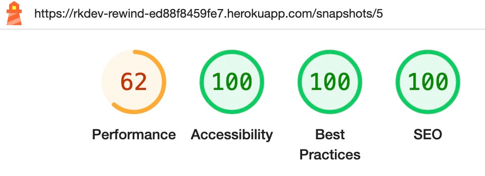
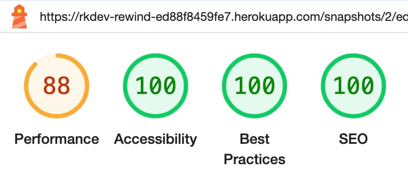
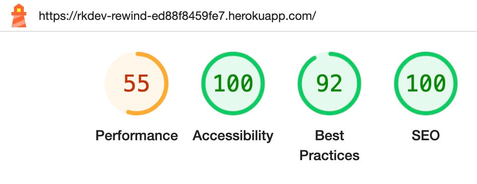
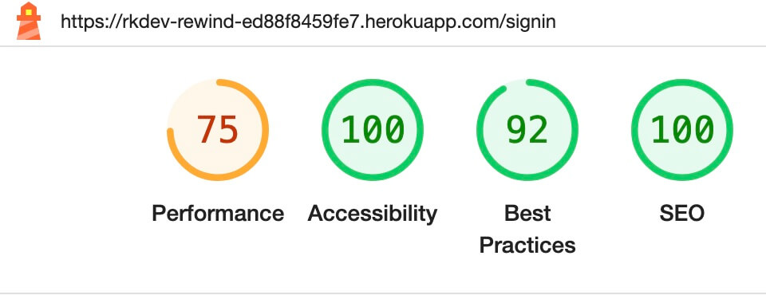
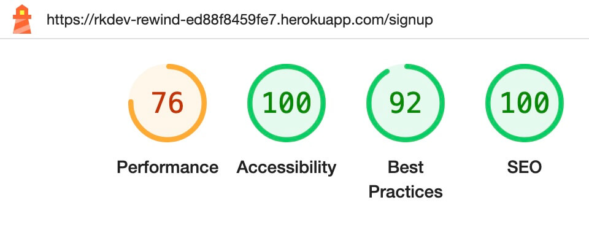
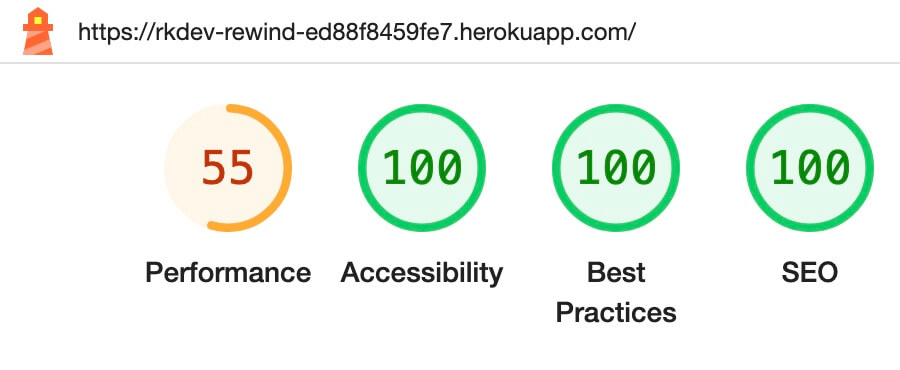
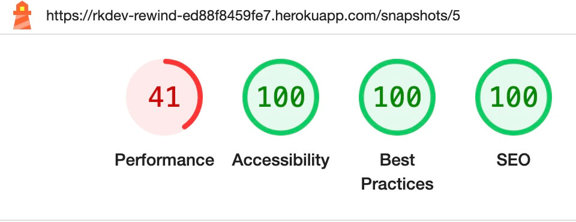
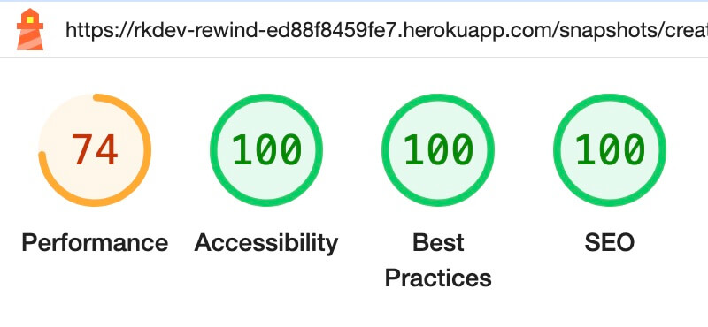
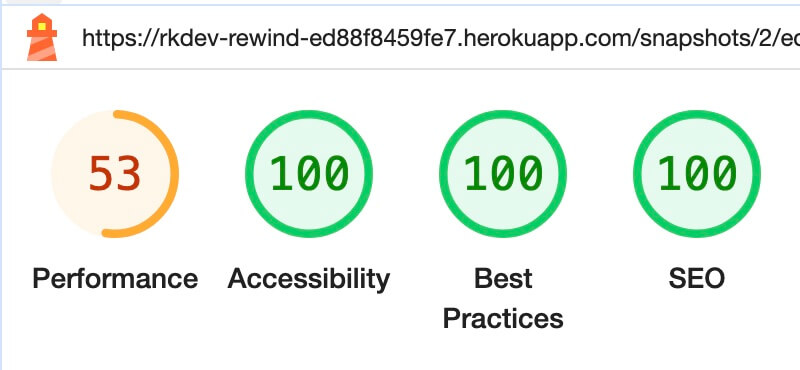
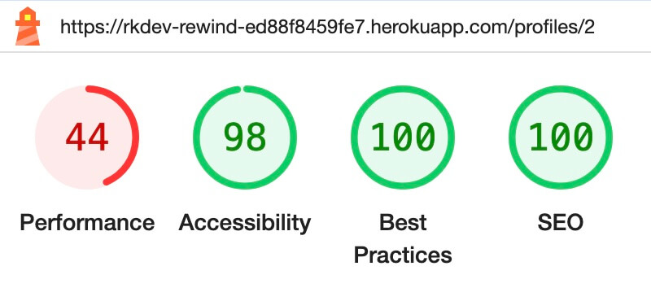

# **Rewind Testing**

## **CONTENTS**

* [Manual Testing](#manual-testing)
    * [User Story Testing](#user-story-testing)
    * [Full Testing](#full-testing)
    * [Defensive Testing](#defensive-testing)
    * [Form Testing](#form-testing)
    * [Javascript Testing](#javascript-testing)
* [Automated Testing](#automated-testing)
    * [Unit Testing](#unit-testing)
* [Validators](#validators)
    * [PEP8 Validation](#pep8-validation)
    * [JSHint Javascript Validation](#jshint-javascript-validation)
    * [W3C Markup HTML Validator](#w3c-html-markup-validator)
    * [W3C CSS Validator](#w3c-css-validator)
* [Performance](#performance)
    * [Lighthouse](#lighthouse)
    * [Wave Accessibility](#wave-accessibility)
* [Responsiveness](#responsiveness)

# **Manual Testing**

## **User Story Testing**

## **Full Testing**

## **ALL USERS**

| Action | Expected Outcome | Pass/Fail |
| ---- | ---- | :----: |
| User enters site url https://rkdev-rewind-ed88f8459fe7.herokuapp.com/ in a web browser  | User directed to home page  | Pass |

## NavBar

| Action | Expected Outcome | Pass/Fail |
| ---- | ---- | :----: |
| User clicks on brand name on the left of the navbar | User redirected to the home page | Pass |
| Hover over  and move away from brand name in nav bar | Link opacity added to brand name on hover and no opacity on moving away. Cursor turns to pointer | Pass |
| User hovers over nav bar links  | Link colour transformed on hover and returns to original on moving away. Cursor turns to pointer | Pass   |
| User hovers over hamburger toggler on screens below 992px | Link colour transformed on hover and returns to original on moving away. Cursor turns to pointer | Fail | 
| User clicks on hamburger toggler on screens below 992px when menu items collapsed | Vertical navbar links expanded | Pass |
| User clicks on hamburger toggler or anywhere else on the screen on screens below 992px when menu items expanded. | Vertical navbar links collapsed | Pass |
| Navigate between pages from nav bar links | Navbar link for active page text colour changes colour to indicate active | Pass |

## Footer

| Action | Expected Outcome | Pass/Fail |
| ---- | ---- | :----: |
|  |  |   |
| Hover over and move away from each footer icon link | Link colour transformed on hover and returns to original on moving away | |
| User clicks on GitHub Icon in footer | New browser tab opens displaying GitHub repo for Rewind | Fail |

## SnapshotsPage - HOME

| Action | Expected Outcome | Pass/Fail |
| ---- | ---- | :----: |
| User navigates to home page  | Snapshots listed in descending order and sorted by date created.  Search bar and sort icons appear at top of page above first snapshot  | Pass |
| User scrolls through snapshots | More snapshots load automatically as user scrolls (if more than 10 exist) | Fail |
| User enters text into the search bar | Results filter dynamically with a 1 second pause after the user stops typing.  Snapshots will be displayed if text input matches any text in the title, era, genre or category of the snapshot | Pass |
| User enters text into the search bar that does not match any text in the defined API search fields | Message displayed to user, informing that no snapshots could be found and recommending to adjust their search phrase | Pass |
| User hovers over each of the sort icons | Icon colour transformed on hover and returns to original on moving away | Pass |
| User clicks on 'Recommendations' sort icon | Snapshots sorted by recommendation count (descending) without the page refereshing | Pass |
| User clicks on 'Comments' sort icon | Snapshots sorted by comment count (descending) without the page refereshing | Pass |
| User clicks on 'Date' sort icon | Snapshots sorted by date created (descending) without the page refereshing | Pass |

## Snapshot

| Action | Expected Outcome | Pass/Fail |
| ---- | ---- | :----: |
| User navigates to home page | Each snapshot in the list displays an image, title, description (if it exists), profile avatar and name of the snapshot owner, and date created.  The number of recommendations and number of comments should be displayed for each snapshot.  If samples belong to the snapshot a waveform icon should be displayed | Pass |
| User hovers or clicks on recommendation icon | Icon colour transformed on hover and returns to original on moving away.  Tooltip displayed, informing user that they must sign in to recommend a snapshot | Pass |
| User hovers over comment icon | Icon colour transformed on hover and returns to original on moving away | Pass |
| User clicks on comments icon | User redirected to detail page for associated snapshot | Pass |
| User hovers over waveform icon | Opacity effect applied on hover and returns to original on moving away.  Tooltip displayed, informing user that samples are available for this snapshot | Pass |
| User clicks on waveform icon | User redirected to detail page for associated snapshot | Pass |

## SnapshotPage

| Action | Expected Outcome | Pass/Fail |
| ---- | ---- | :----: |
| User clicks on snapshot image,comments icon or waveform icon | User redirected to detail page for associated snapshot.  Approved samples associated with the snapshot are listed in date created descending order below the snapshot. First 10 comments associated with the snapshot are displayed in date created descending order below any samples.  If no comments exist, display message to inform user | Pass |
| User scrolls through comments | More comments load automatically as user scrolls (if more than 10 exist) | Pass |
| User clicks play button of audio player | Playback of sample begins | Pass |
| User clicks pause button of audio player | Playback of sample stops | Pass |

## ProfilePage

| Action | Expected Outcome | Pass/Fail |
| ---- | ---- | :----: |
| User clicks on avatar of a profile | User redirected to the profile page of the associated profile.  Stats for the snapshots count, followers count and following count associated with the profile are displayed along side the profile image, name and bio(if it exists).  All snapshots owned by the profile are listed below | Pass |

## **UNAUTHENTICATED USER**

## NavBar

| Action | Expected Outcome | Pass/Fail |
| ---- | ---- | :----: |
| User enters site url https://rkdev-rewind-ed88f8459fe7.herokuapp.com/ in a web browser | Navbar displays links for Home, Sign In and Sign Up | Pass |
| User clicks on 'Home' navbar link | User redirected to the home page | Pass |
| User clicks on 'Sign Up' navbar link | User redirected to Sign Up Form | Pass |
| User clicks on 'Sign In' navbar link | User redirected to Sign In Form | Pass |

## SnapshotsPage - HOME

| Action | Expected Outcome | Pass/Fail |
| ---- | ---- | :----: |
| User navigates to home page | Hero Image, 'Take a trip back in time' heading and call to action button displayed to right of snapshot list. (Appears above snapshot list on mobile devices below 992px) | Pass |
| User hovers over 'Get started' call to action button | Button colour transformed on hover and returns to original on moving away | Pass | 
| User clicks on 'Get started' call to action button | User redirected to 'Sign Up' page | Pass |

## SignUpForm

| Action | Expected Outcome | Pass/Fail |
| ---- | ---- | :----: |
|  |  |   |
| User hovers over 'Sign Up' button on sign up form | Button hover transformation applied | Pass |
| User clicks on 'Sign Up' button with a valid form | User redirected to Sign In Form prepopulated with new user details | Pass |
| User hovers over 'Sign In' redirect link | Link text colour changes to site secondary colour | Pass |
| User clicks on 'Sign In' redirect link | User redirected to Sign In Form | Pass |

## SignInForm

| Action | Expected Outcome | Pass/Fail |
| ---- | ---- | :----: |
| User hovers over 'Sign In' button on login form  | Button hover transformation applied | Pass |
| User clicks on 'Sign In' button with a valid form | User logged in and redirected to the home page. A bootstrap toast is displayed to inform the user they are sucessfully logged in | Pass |
| User hovers over 'Sign Up' redirect link | Link text colour changes to site secondary colour | Pass |
| User clicks on 'Sign Up' redirect link | User redirected to Sign Up Form | Pass |

## **AUTHENTICATED USER**

## NavBar

| Action | Expected Outcome | Pass/Fail |
| ---- | ---- | :----: |
| User enters site url https://rkdev-rewind-ed88f8459fe7.herokuapp.com/ in a web browser | Navbar displays links: Home, For You, Pinned, Sign Out and Profile Avatar | Pass |
| User clicks on 'Home' navbar link | User redirected to the home page | Pass |
| User clicks on 'For You' navbar link | User redirected to page displaying snapshots for profiles they are following | Pass |
| User clicks on 'Pinned' navbar link | User redirected to page displaying snapshots they have pinned | Pass |
| User clicks on 'Profile/ Avatar' navbar link | User redirected to their own profile page | Pass |
| User clicks on 'Sign Out' navbar link | User logged out.  A bootstrap toast is displayed to inform the user they are sucessfully logged out | Pass |

## Snapshot

| Action | Expected Outcome | Pass/Fail |
| ---- | ---- | :----: |
| User hovers over or clicks on recommendation icon when they own the snapshot | Tooltip dsiplayed, informing user that they cannot recommend their own snapshot | Pass |
| User clicks on recommendation icon for a snapshot owned by another user | Recommendation icon turns solid colour and recommendation count increments by 1. Toast message displayed informing user they have recommended the snapshot | Pass |
| User clicks on recommendation icon for a snapshot they have already recommended | Recommendation icon turns to outline and recommendation count decreases by 1. Toast message displayed informing user they have removed recommendation for the snapshot | Pass |
| Hover and click on bookmark icon below snapshot | Icon outline changes colour on hover and turns solid colour on click to indicate that the snapshot has been pinned.  Toast message displayed informing user they have pinned the snapshot | Pass |
| Hover and click on bookmark icon below snapshot that has already been pinned | Icon changes colour on hover and turns to outline icon on click to indicate that the snapshot has been unpinned.  Toast message displayed informing user they have unpinned the snapshot | Pass |

## SnapshotPage

| Action | Expected Outcome | Pass/Fail |
| ---- | ---- | :----: |
| User clicks on snapshot image, comments icon or waveform icon | User redirected to detail page for associated snapshot.  Sample upload form and Comment submit form displayed above snapshot.  Any samples that have been approved by site admin are visible to all users.  Samples that have not been approved are only visible to the owner.  For any comments owned by the current user, an edit and delete icon is displayed next to the comment.  For any samples owned by the current user, a delete icon is displayed next to the sample.  An edit and delete button is also displayed for the snapshot itself if the user owns the snapshot | Pass |
| User clicks on edit icon next to a snapshot they own | User redirected to Snapshot Edit Form | Pass |
| User clicks on delete icon next to a snapshot they own | Modal displayed to confirm deletion.  Upon confirming the action, snapshot deleted and removed from snapshot list. Snapshot count for the profile of the owner should decrease by 1.  Toast message displayed informing user they have deleted their snapshot | Pass |
| User attempts to post an empty comment | 'Post' button has opacity effect applied to indicate that it is disabled and clicking has no effect | Pass |
| User creates and submits a new comment | 'Post' button becomes active as the user types text.  Once posted, the comment appears at top of the comments list and toast message is displayed informing user they have added a comment.  Created date should display as 'now' initially.  Comment count should increase by 1 | Pass |
| User selects sample file and submits | Sample appears below snapshot with opacity effect applied. On hovering over pending icon, a tooltip is used to convey message that approval is pending.  A delete icon is displayed next to the sample | RE-TEST |
| User clicks on edit icon next to a comment they own | Comment edit form displayed, prepopulated with existing comment | Pass |
| User clicks on Comment edit form cancel button | Comment edit form hidden | Pass |
| User amends comment and clicks on Comment edit form save button | Comment edit form hidden and amended comment content displayed.  Toast message displayed informing user they have updated their comment | Pass |
| User clicks on delete icon next to a comment they own | Modal displayed to confirm deletion.  Upon confirming the action, comment deleted and removed from comment list. Comment count decreases by 1. Toast message displayed informing user they have deleted their comment | Pass |
| User clicks on delete icon next to a sample they own | Modal displayed to confirm deletion.  Upon confirming the action, sample deleted and removed from sample list. Toast message displayed informing user they have deleted their sample | DOUBLE CHECK |

## SnapshotsCreateForm

| Action | Expected Outcome | Pass/Fail |
| ---- | ---- | :----: |
| User clicks on Add Snapshot Icon | Snapshot Create Form displayed | Pass |
| User clicks on Cancel button | User directed back to the page they were previously on | Pass |
| User completes valid field entries and clicks on 'create' button | User redirected to the snapshot detail page of the newly created snapshot and toast message displayed to confirm successful creation | RE-TEST |

## SnapshotEditForm

| Action | Expected Outcome | Pass/Fail |
| ---- | ---- | :----: |
| User clicks on pencil icon for a snapshop that they own | User directed to Snapshot edit page | Pass |
| User clicks on Snapshot Edit Form cancel button | User redirected back to Snapshot detail Page | Pass |
| User updates any snapshot fields and clicks save button | User redirected back to Snapshot detail Page and amended information displayed.  Toast message displayed informing user they have updated their snapshot | Pass |
| User clicks save button with no fields updated | User redirected back to Snapshot detail Page | Pass | 

## SnapshotsPage - FOR YOU

| Action | Expected Outcome | Pass/Fail |
| ---- | ---- | :----: |
|  |  |   |
| User navigates to 'For You' page | All snapshots belonging to any profiles that the current user is following are displayed.  If the current user is not following any profiles, a message informs them of this and encourages them to start following | Pass |
| User sets preferences for their profile | Snapshots are filtered based on user preferences | Pass |
| User updates preferences for their profile | Filtering of snapshots adjusted based on the updated user preferences | Pass |

## SnapshotsPage - PINNED

| Action | Expected Outcome | Pass/Fail |
| ---- | ---- | :----: |
|  |  |   |
| User navigates to 'Pinned' page | All snapshots that the user has pinned are displayed.  Most recently pinned is displayed first.  If they have not pinned any snapshots, a message informs them of this | Pass |
| User unpins a snapshot | The list of snapshots is updated to reflect this change, with the unpinned snapshot no longer visible | Pass |

## RelevantProfile - HOME, FOR YOU, PINNED, PROFILE PAGE

| Action | Expected Outcome | Pass/Fail |
| ---- | ---- | :----: |
| User navigates to home, 'For You' or 'Pinned' page | If the user has not added any preference information to their profile, a 'Tell us more' box directing them to their profile edit page is displayed to the right of snapshot list. (Appears above snapshot list on mobile devices below 992px).  A list of 'popular profiles' appears below.  This is sorted (descending order) by the number of followers each profile has. | Pass |   
| User sets their preferences on the profile edit page | 'Profiles you might like' are displayed by matching current user preferences to other profile preferences. The current user's profile is not displayed as part of these suggestions | Pass |
| User sets their preferences on the profile edit page but there are no matches to the preferences of other profiles | The 'Tell us more' box and 'popular profiles' remain displayed | Pass | 
| User clicks on the 'follow' button next to a profile | Button changes to display 'unfollow'.  The 'followers' count for the selected profile and the 'following' count for the current user increment by 1. | Pass |
| User clicks on the 'unfollow' button next to a profile | Button changes to display 'follow'.  The 'followed' count for the selected profile and the 'following' count for the current user decrease by 1. | Pass |

## ProfilePage

| Action | Expected Outcome | Pass/Fail |
| ---- | ---- | :----: |
| Authenticated user navigates to their own profile page | Icons for edit profile, change username and change password are displayed below their profile stats.  All snapshots owned by the current user are listed below their profile info | Pass |
| User clicks on edit profile icon | User redirected to Profile Edit Form | Pass |
| User clicks on change username icon | User redirected to Username Form | Pass |
| User clicks on change password icon | User redirected to User Password Form | Pass |
| All users navigate to another user's profile page | Picture and name displayed. Stats for snapshot count, follower count and following count associated with the profile are displayed.  All snapshots belonging to the profile are listed | Pass |
| Authenticated user navigates to another user's profile page | Additional to the info displayed to all users, a follow/unfollow button is displayed | Pass |

## ProfileEditForm

| Action | Expected Outcome | Pass/Fail |
| ---- | ---- | :----: |
| User clicks on Profile Edit Form cancel button | User redirected back to Profile Page | Pass |
| User updates profile information and clicks save button | User redirected back to Profile Page and amended information displayed.  Toast message displayed informing user they have updated their profile | Fail |

## UsernameForm

| Action | Expected Outcome | Pass/Fail |
| ---- | ---- | :----: |
| User clicks on Username Form cancel button | User redirected back to Profile Page | Pass |
| User updates username and clicks save button | User redirected back to Profile Page and amended information displayed.  Toast message displayed informing user they have updated their username | Pass |
| User signs out and attempts sign in using updated username | User signed in successfully | Pass |

## UserPasswordForm

| Action | Expected Outcome | Pass/Fail |
| ---- | ---- | :----: |
| User clicks on User Password Form cancel button | User redirected back to Profile Page | Pass |
| User updates, confirms updated password and clicks save button | User redirected back to Profile Page.  Toast message displayed informing user they have updated their password | Pass |
| User signs out and attempts to sign in using updated password | User signed in successfully | Pass |

## Sign Out

| Action | Expected Outcome | Pass/Fail |
| ---- | ---- | :----: |
| Authenticated user clicks 'sign out' nav link | User signed out and only has access to unauthenticated site content.  Toast message displayed informing the user that they have signed out | Pass |

 

[Back to top &uarr;](#contents)

## **Form Testing**

All forms have been checked thoroughly to ensure they cannot be submitted until all fields are valid.

**Snapshot Create Form**

| Field | Action | Expected Outcome | Pass/Fail |
| ---- | ---- | ---- | ---- |
| title | Input > 150 characters | Form prevents input of any additional characters | Pass |
| title | Input empty | Form displays warning 'This field may not be blank' | Pass |
| image | No file selected | Alert warns 'The submitted data was not a file. Check the encoding type on the form.'| Pass |
| image | File selected exceeds 2MB in size | Alert warns 'Please choose an image smaller than 2MB' | Pass |
| image | File selected width > 4096px | Alert warns 'Image width larger than 4096px!' | Pass |
| image | File selected height > 4096px | Alert warns 'Image height larger than 4096px!' | Pass |
| genre | No genre selected from dropdown menu | Form displays warning 'This field may not be null.' | Pass |
| era | No era selected from dropdown menu | Form displays warning 'This field may not be null.' | Pass |
| category | No era selected from dropdown menu | Form displays warning 'This field may not be null.' | Pass |

**Snapshot Edit Form**

The Snapshot Edit form is pre-populated data for the specified snapshot.  If no changes are made and the form is submitted there should be no validation warnings.  Changes made to the title or image fields should throw an alert on submission if the updated field is no longer valid.

| Field | Action | Expected Outcome | Pass/Fail |
| ---- | ---- | ---- | ---- |
| title | Input > 150 characters | Form prevents input of any additional characters | Pass |
| title | Input empty | Form displays warning 'This field may not be blank' | Pass |
| image | New file selected exceeds 2MB in size | Alert warns 'Please choose an image smaller than 2MB' | Pass |
| image | New file selected width > 4096px | Alert warns 'Image width larger than 4096px!' | Pass |
| image | New file selected height > 4096px | Alert warns 'Image height larger than 4096px!' | Pass |

 

**Comment Create/ Edit Form**

Prevention of new empty comments being submitted is handled by disabling the submit button until text has been entered.

| Field | Action | Expected Outcome | Pass/Fail |
| ---- | ---- | ---- | ---- |
| content | No text entered | Post button remains disabled and user unable to submit form | Pass |
| Content | User removes all text when updating a comment and tries to submit | Form displays warning 'This field may not be blank' | Pass |

 

**Sample Create Form**

| Field | Action | Expected Outcome | Pass/Fail |
| ---- | ---- | ---- | ---- |
| audio | No file selected | Alert warns 'The submitted data was not a file. Check the encoding type on the form.'| Pass |
| audio | File selected exceeds 2MB in size | Alert warns 'Please choose an image smaller than 2MB' | Pass |
| audio | Attemp to submit form when 5 samples already belong to the specified snapshot | Alert warns 'Sorry, the maximum number of samples have been added for this snapshot' | Pass |

## **Validators**

### **PEP8 Validation:**

 

I passed all python files through the [Code Institute Python Linter](https://pep8ci.herokuapp.com/) and no errors are found. Results of this testing can be seen below:

 

App: rewind

| File | Errors | Result |
| :----: | :-------: | :------: |
| asgi.py | 0 | Passed |
| permissions.py | 0 | Passed |
| serializers.py | 0 | Passed |
| settings.py | 0 | FAILED |
| urls.py | 0 | Passed |
| views.py | 0 | Passed |
| wsgi.py | 0 | Passed |

App: categories

| File | Errors | Result |
| :----: | :-------: | :------: |
| admin.py | 0 | Passed |
| apps.py | 0 | Passed |
| models.py | 0 | Passed |
| serializers.py | 0 | Passed |
| tests.py | 0 | Passed |
| urls.py | 0 | Passed |
| views.py | 0 | Passed |

App: comments

| File | Errors | Result |
| :----: | :-------: | :------: |
| admin.py | 0 | Passed |
| apps.py | 0 | Passed |
| models.py | 0 | Passed |
| serializers.py | 0 | Passed |
| tests.py | 0 | Passed |
| urls.py | 0 | Passed |
| views.py | 0 | Passed |

App: eras

| File | Errors | Result |
| :----: | :-------: | :------: |
| admin.py | 0 | Passed |
| apps.py | 0 | Passed |
| models.py | 0 | Passed |
| serializers.py | 0 | Passed |
| tests.py | 0 | Passed |
| urls.py | 0 | Passed |
| views.py | 0 | Passed |

App: followers

| File | Errors | Result |
| :----: | :-------: | :------: |
| admin.py | 0 | Passed |
| apps.py | 0 | Passed |
| models.py | 0 | Passed |
| serializers.py | 0 | Passed |
| tests.py | 0 | Passed |
| urls.py | 0 | Passed |
| views.py | 0 | Passed |

App: genres

| File | Errors | Result |
| :----: | :-------: | :------: |
| admin.py | 0 | Passed |
| apps.py | 0 | Passed |
| models.py | 0 | Passed |
| serializers.py | 0 | Passed |
| tests.py | 0 | Passed |
| urls.py | 0 | Passed |
| views.py | 0 | Passed |

App: pins

| File | Errors | Result |
| :----: | :-------: | :------: |
| admin.py | 0 | Passed |
| apps.py | 0 | Passed |
| models.py | 0 | Passed |
| serializers.py | 0 | Passed |
| tests.py | 0 | Passed |
| urls.py | 0 | Passed |
| views.py | 0 | Passed |

App: profiles

| File | Errors | Result |
| :----: | :-------: | :------: |
| admin.py | 0 | Passed |
| apps.py | 0 | Passed |
| models.py | 0 | Passed |
| serializers.py | 0 | Passed |
| tests.py | 0 | Passed |
| urls.py | 0 | Passed |
| views.py | 0 | Passed |

App: recommendations

| File | Errors | Result |
| :----: | :-------: | :------: |
| admin.py | 0 | Passed |
| apps.py | 0 | Passed |
| models.py | 0 | Passed |
| serializers.py | 0 | Passed |
| tests.py | 0 | Passed |
| urls.py | 0 | Passed |
| views.py | 0 | Passed |

App: samples

| File | Errors | Result |
| :----: | :-------: | :------: |
| admin.py | 0 | Passed |
| apps.py | 0 | Passed |
| models.py | 0 | Passed |
| serializers.py | 0 | Passed |
| tests.py | 0 | Passed |
| urls.py | 0 | Passed |
| views.py | 0 | Passed |

App: snapshots

| File | Errors | Result |
| :----: | :-------: | :------: |
| admin.py | 0 | Passed |
| apps.py | 0 | Passed |
| models.py | 0 | Passed |
| serializers.py | 0 | Passed |
| tests.py | 0 | Passed |
| urls.py | 0 | Passed |
| views.py | 0 | Passed |

Main Directory:

| File | Errors | Result |
| :----: | :-------: | :------: |
| manage.py | 0 | Passed |

 

[Back to top &uarr;](#contents)

### **W3C HTML Markup Validator**

HTML has been validated using the [W3C](https://validator.w3.org/) Markup Validator .  No errors or warnings were displayed.

[Back to top &uarr;](#contents)

### **W3C CSS Validator**

I used the [W3C jigsaw](https://jigsaw.w3.org/css-validator/) CSS Validation Service to validate my CSS files.  All files were error free.

| File | Errors | Result |
| ---- | :------: | :------: |
| frontend/src/App.module.css | 0 | Pass |
| frontend/src/styles/AddSnapshot.module.css | 0 | Pass |
| frontend/src/styles/AlertPopup.module.css | 0 | Pass |
| frontend/src/styles/Asset.module.css | 0 | Pass |
| frontend/src/styles/Avatar.module.css | 0 | Pass |
| frontend/src/styles/Button.module.css | 0 | Pass |
| frontend/src/styles/Comment.module.css | 0 | Pass |
| frontend/src/styles/CommentCreateEditForm.module.css | 0 | Pass |
| frontend/src/styles/Footer.module.css | 0 | Pass |
| frontend/src/styles/NavBar.module.css | 0 | Pass |
| frontend/src/styles/NotFound.module.css | 0 | Pass |
| frontend/src/styles/Profile.module.css | 0 | Pass |
| frontend/src/styles/ProfilePage.module.css | 0 | Pass |
| frontend/src/styles/Sample.module.css | 0 | Pass |
| frontend/src/styles/SignInUpForm.module.css | 0 | Pass |
| frontend/src/styles/Snapshot.module.css | 0 | Pass |
| frontend/src/styles/SnapshotCreateEditForm.module.css | 0 | Pass |
| frontend/src/styles/SnapshotPage.module.css | 0 | Pass |
| frontend/src/styles/SnapshotsPage.module.css | 0 | Pass |
| frontend/src/styles/ToastPopup.module.css | 0 | Pass |
| frontend/src/index.css | 0 | Pass |

The only warnings that occur relate to the use of vendor pseudo elements, vendor extensions and use of variables.  I am satisfied that these are not causing any issues with the functionality of the site.

# **Performance**

## **Lighthouse**

### Improvements

I used Lighthouse within Google Chrome developer tools as a way of testing performance, accessibility, best practices and SEO for the site.  The improvements I made using the Wave Accessibility tool ensured that accessibility scores are **100** on all pages.  

Any recommendations for best practice were also implemented, and the only pages that do not achieve **100** scores are the home landing page, sign up page and sign in page. The reason for this is that HTTP 401 errors are logged to the console, therefore bringing best practice scores down to **92**.  However, 3 errors are to be expected when a user arrives on the home page as 3 network requests are required to establish whether the user is really logged out.  401 errors are also logged when navigating to sign up/ sign in pages as a consequence of checking the user's authorisation status and whether they should be redirected away from these pages if an attempt is made to access them.

### Opportunities

Several opportunities were flagged by the lighthouse report to improve performance throughout the site,  particularly when testing for mobile.

* Preload Largest Contentful Paint image
* Properly size images
* Serve images in next-gen formats
* Enable text compression
* Eliminate render-blocking resources

Size and format of images being served is an area that should be looked into further during future iterations.  I have already implemented server side logic in the Snapshots serializers file to prevent images over 2MB in size being uploaded.  I have tested the site on various devices and networks and the issue does not seem to be impacting page load times to the detriment of the user.

Desktop Results

 

**Home Page Unauthenticated**

**Sign In Page**

**Sign Up Page**

**Home Authenticated User**

**Snapshot Detail**

**Add Snapshot**

**Edit Snapshot**

**Profile Page**

Mobile Results

 

**Home Page Unauthenticated**

**Sign In Page**

**Sign Up Page**

**Home Authenticated User**

**Snapshot Detail**

**Add Snapshot**

**Edit Snapshot**

**Profile Page**

## **Wave Accessibility**

All pages of the site have been passed through the [Wave Chrome Extension](https://wave.webaim.org/extension/) to check for accessibility performance.  No errors are logged on any pages.  I have checked warnings to ensure they are acceptable.

Wave Results

 

